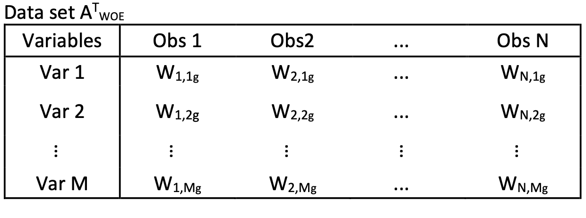
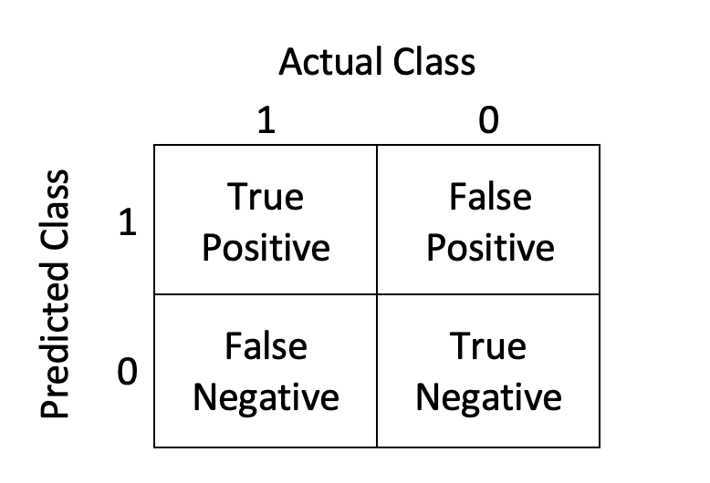

```{r setup, include=FALSE}
knitr::opts_chunk$set(echo = TRUE, message = FALSE, warning = FALSE)

library(dplyr)
library(kableExtra)
library(ROCit)
```

\newpage

# Introduction

This paper demonstrates how each of the functions works in the Rprofet package while presenting a workflow of credit scoring by using the resources in this package. The workflow starts with data splitting and goes through each function using the Lending Club data. The process generally follows variable binning, applying Weight of Evidence (WOE) transformation and calculating information value (IV) for each variable, variable selection, visualize the selected variables and fine-tuning if necessary. Then further variable selection can be done again and a scorecard will be built after fitting a logistic regression model with the selected variables. After doing all these steps on the training data, we can apply the scorecard to the validation data. 

The functions in the package are listed below:

1. Variable Binning
    + BinProfet
2. Weight of Evidence Transformation and Information Value
    + WOEProfet
3. Variable Selection
    + WOEclust_hclust
    + WOEclust_kmeans
    + Var_select
5. Visualization and Fine-tuning Variables
    + WOEplotter
    + WOE_customNum
    + WOE_customFac
6. Scorecard and Scoring Validation data
    + ScorecardProfet
    + ScoreDataProfet
    
```{r load package and data, echo=FALSE}
library(Rprofet)
data = load(file="lending_club.rda")
data = lending_club
rm(lending_club)
```
  
The dataset we will be using to illustrate the workflow of the Rprofet package is called Lending Club data. LendingClub is a lending marketplace, it is a peer-to-peer lending platform that connects investors with potential borrowers and offers both personal and business loans. Instead of getting loans from a bank or financial institution, an investor funds a borrower's loan as a lender. The Lending Club data consists of 20000 observations and 74 variables. Each observation represents a borrower, and the characteristics have various information relating to the borrower. The variable "bad" is our target variable and the "ID" variable is unique for each observation. A target variable and an ID variable are required in order to use almost all functions in the Rprofet package. In this data, an observation with target variable "bad" being 1 represents a loan default. The independent variables can be a mixture of character, factor, continuous, and binary data. It is important to note that this package assumes unique IDs, and all categorical data should be converted to factor data before using the functions. The goal of the Rprofet package is to allow the user control over each step of the credit scoring process when building a scorecard and applying the scorecard to a validation data while still being flexible enough to handle the "messy" data. The "messy" data refers to data with multiple variable types, missing values, outliers, and special values, and such data is common in credit industry. Table \ref{tab:data-preview} shows the snapshot of the first 10 columns of the Lending Club data. For our workflow example, we first split the data into training and validation datasets with an 80:20 ratio. We will be building a scorecard based on the training set and using the scorecard to score the validation set. Table \ref{tab:data-set-summary} shows the dimension and bad rate of the datasets.
    
```{r data-preview, echo=FALSE}
#dim(data)
#head(data[1:10])

kableExtra::kbl(head(data[,1:10]), 
                caption = "Head of first 10 columns of lending club data", 
                booktabs = T,
                linesep = "") %>%
  kable_styling(latex_options = c("striped", "scale_down"))

#splitting data
set.seed(112233)
##splitting data
n <- nrow(data)
split <- sample(c(rep(0, 0.8 * n),
                  rep(1, 0.2 * n)))

train <- data[split == 0, ] 
validation <- data[split == 1, ]

tb = data.frame(Dataset=c('Original','Training','Validation'), Rows=0, Columns=0, "TargetRate"=0)
tb[1,2:3] = dim(data)
tb[2,2:3] = dim(train)
tb[3,2:3] = dim(validation)
tb[1,4] = round(table(data$bad)[2]/table(data$bad)[1],3)
tb[2,4] = round(table(train$bad)[2]/table(train$bad)[1],3)
tb[3,4] = round(table(validation$bad)[2]/table(validation$bad)[1],3)
```
```{r data-set-summary, echo=FALSE}
#datasets summary
kableExtra::kbl(tb, caption = "Dimension of datasets",
                booktabs = T,
                linesep = "") %>%
  kable_styling(latex_options = "striped")
```

# Coarse Binning of the variables

Binning variables is a process of transforming variables by dividing the values of each variable into fewer groups. The groups should make logical sense or have the same relative risk. This process is also referred to as coarse classing or grouping [\ref{Anderson}]. Variable binning converts continuous variables to categorical. For categorical variables, they already have the initial bins. Thus, all types of variables are transformed into categorical variables after binning process. 

An advantage of binning variables is that it reduces the inconsistencies within data such as non-linear relationships, missing values, and outliers. Missing values and outliers are commonly found in financial industry data and caused by various reasons. For example, figure \ref{fig:var-bf-bin} shows the distribution of the "Month since recent inquiry" variable in the training data is right skewed. In addition, there are 1793 missing values in the variable that are not recognizable in the figure. 

```{r var-bf-bin, fig.cap = "Original Distribution of Month since recent inquiry", fig.height=3, fig.width=4.5, echo=FALSE, warning=FALSE}
ggplot2::ggplot(data = train,  ggplot2::aes(x = mths_since_recent_inq)) + 
  ggplot2::geom_histogram(binwidth=1, color="white", fill = "#0066CC") +
  ggplot2::theme(legend.position = "none", axis.text.x = ggplot2::element_text(angle = 45, hjust = 1))+
  ggplot2::scale_x_continuous(breaks = seq(0, 25, 5))
```


Since many statistical models use complete case approaches, we need to take care of the missing values in our datasets. In most cases, missing values in financial data are not random, they might represent part of some characteristics or trends. There are many ways to handle the missing data, a good practice is to group the missing values together and treat it as a separate attribute. Assigning special values to the missing values is another imputation method that may reduce information lost. Therefore, the missing values can be included in logistic regression models and assigned points in the scorecard. Outliers may be typing errors, extreme cases, or even frauds. They usually affect the regression analysis negatively and thus should be investigated first [\ref{Siddiqi}]. 

There are a variety of different binning techniques available. More powerful predictor variables tend to have greater number of potential coarse bins. Thus, creating too few bins for a characteristic can lose important information. On the contrary, creating too many bins can increase the chance of overfitting. According to Anderson [\ref{Anderson}], the goal of variable binning is to keep as few bins as possible while minimize the information loss in variables. The number of bins for a variable should not exceed 10 in most cases, and the bins are not necessarily equal sized. However, grouping variables into equal sized bins is a common practice. In addition, variables can also be grouped into bins with evenly spaced intervals based on the minimum and maximum values of the variable. The binning method in this package uses the greedy binning algorithm from the binr package [\ref{binr}] that sorts values of an variable first and then fills the target number of bins with the values until they contain about the same number of observations. In this way, we are able to establish a basic relationship between the response and predictor variables and eliminate unimportant information in data such as outliers. One important consideration is making sure the number of cases in each group is sufficient. The definition of "sufficient" varies and it requires some judgments by users. Anderson referred to two standards for sufficient binning, one states that there should be at least 40 of each outcome per coarse class while another states that each bin should contain a minimum of 5% of the population. If there are too few observations within a bin, joining similar groups can help to avoid the issue. The customized binning functions in later section are able to handle this issue. After binning, each characteristic should make logical sense, and each continuous characteristic usually have a monotonic relationship with the response function such as target rate.

When using the \textbf{BinProfet()} function, multiple inputs for general shaping of the coarse bins are provided. For instance, we wish to specify that we would like each of the numeric variables to have $10$ bins and also would like each bin to have a minimum of $200$ observations. Using the specified parameters, we then can perform coarse binning with the function. 

```{r coarse-binning}
binData = BinProfet(data = train, id = "ID", target = "bad", num.bins = 10,
                        min.pts.bin = 200)
```
```{r head-of-binned-data, echo=FALSE}
kableExtra::kbl(head(binData[1:10]), 
                caption = "Head of first 10 columns of the binned data", 
                booktabs = T,
                linesep = "") %>%
  kable_styling(latex_options = c("striped", "scale_down", "hold_position"))
```

Table \ref{tab:head-of-binned-data} is a snapshot of the output of the \textbf{BinProfet()} function. It returns a data frame with binned continuous values while making the factor variables stay the same. The missing values of each variables were treated as a separate attribute called "Missing." After binning, all variables have factor data type which handles the inconsistencies of the data type.

```{r var-af-bin, fig.cap = "Distribution of binned Months since recent inquiry", fig.height=3, fig.width=4.5, echo=FALSE, warning=FALSE}
ggplot2::ggplot(data = binData,  ggplot2::aes(x = mths_since_recent_inq_Bins)) +
  ggplot2::geom_bar(color="white", fill = "#0066CC", width=0.7) +
  ggplot2::theme(legend.position = "none", axis.text.x = ggplot2::element_text(angle = 45, hjust = 1))
```

Figure \ref{fig:var-af-bin} shows the frequency of each bin for the "Months since recent inquiry" variable. We can see that the function will generally create approximately equal sized bins as the number of observations in each of the bins are close. Although the function tends to output the specified number of equal sized bins, this is not always the case as we see the second last bin has the smallest number of observations. In this case, we would consider combining the second last bin with the third last bin. Comparing figure \ref{fig:var-af-bin} to figure \ref{fig:var-bf-bin}, the binned variable is more evenly distributed and the missing values are binned into its own group. The uneven bin size is due to the original distribution of this variable, as we can see most observations are concentrated on values between 0 and 5 and then the number of observations decreases as months since recent inquiry increases. Sometimes the function outputs less or more bins than the specified number of bins, this happens because the bins will likely contain many outliers or values that would skew the distribution significantly. Even when the distribution of a variable is symmetric, the greedy binning algorithm may not create symmetric bins if there are multiple tied values. When the binning algorithm could not allocate all values into the specified number of bins, it tends to create extra bins. This situation would lead to less observations than the specified minimum number in the extra bins. When the input number of bins or minimum points in each bin are too large for a variable, the binning algorithm would tend to create less bins than the specified attribute or ignore the minimum points bucket. Users might want to adjust the attributes if the majority of variables was not binned as expected, or fine tune some specific variables such as combining or separating certain bins using the customize binning functions mentioned in later section.

Another binning algorithm that is quantile-based performs similarly to the greedy algorithm. The two binning methods would create different bins for the numerical variables, but the two logistic models built in the end have similar predicting power. We decided to use the greedy binning method for \textbf{BinProfet()}, and when time allows we will be implementing a binning function using a quantile-based method.

```{r binned-var-ex, echo=FALSE, include=FALSE}
kableExtra::kbl(table(binData$mths_since_recent_inq_Bins), 
                col.names = c("Variable Bins", "Frequency"), 
                caption = "Frequency of each bin for annual income",
                booktabs = T,
                linesep = "") %>%
  kable_styling(latex_options = "striped")
```

# WOE Transformation of the Bins {#woe-sec}

After binning the mixture types of raw data into categorical variables, the categories can then be converted to a continuous scale by performing Weight of Evidence (WOE) transformation for each bin. In credit scoring, WOE is commonly expressed as 
$$WOE_i = \ln \left[  \frac{ p\left(i \mid y=1\right)} { p\left(i \mid y=0\right) }  \right],$$
where $p\left(i \mid y=1\right)$ is the probability that an observation is in the $i^{th}$ bin given that the observation corresponds to a response variable of $1$, or an event that is true. Similarly, $p\left(i \mid y=0\right)$ is the probability that an observation is in the $i^{th}$ bin given that the observation corresponds to a response variable of $0$, or an event that is false. Therefore, if $\text{WOE}_i$ is positive, then there is a higher probability of being in bin $i$ with a response variable being $1$ than a response variable being $0$, and vice versa. Figure \ref{fig:WoePlot} shows the WOE values with the corresponding bins for variable "Months since recent inquiry." The WOE values would replace the values of the variable in the original data. For example, if an observation had "Months since recent inquiry" equals $16$, it is replaced with $-0.367$.

```{r, WoePlot, fig.cap = "WOE transformed Months since recent inquiry for each bin", fig.height=3.5, fig.width=5, message=FALSE, echo=FALSE}
WOEdata = WOEProfet(data = binData, id = "ID", target = "bad")
data = WOEdata$vars$mths_since_recent_inq
data = data[,c(1,2)]
ggplot2::ggplot(data = data, ggplot2::aes(x = mths_since_recent_inq_Bins, y = mths_since_recent_inq_WOE)) +
  ggplot2::geom_bar(stat = "identity", fill = "#0066CC", width=0.7) +
  ggplot2::geom_text(ggplot2::aes(label = round(mths_since_recent_inq_WOE,3)), vjust = 1.1, size = 3, colour = "black") +
  ggplot2::theme(legend.position = "none", axis.text.x = ggplot2::element_text(angle = 45, hjust = 1)) +
  ggplot2::labs(x = "", y = "WOE")
```

The WOE for a bin is a calculation measuring the log likelihood of being in bin $i$ given the value of the response variable. Let $\sum{0_i}$ and $\sum{0_T}$ be the sum of 0's in bin $i$ and the sum of 0's in the entire dataset respectively. Similarly, let $\sum{1_i}$ and $\sum{1_T}$ be the sum of 1's in bin $i$ and the entire dataset. Then

\begin{align}
\label{eq:woe}
WOE_i &= \ln \left[  \frac{ p\left(i \mid y=1\right)} { p\left(i \mid y=0\right) }  \right] \nonumber\\
&= \ln \left[   \frac{\sum{1_i}/\sum{1_T}}{\sum{0_i}/\sum{0_T}} \right] = \ln \left[ \frac{\sum{1_i}\sum{0_T}}{\sum{0_i}\sum{1_T}} \right] = \ln \left[ \frac{\sum{1_i}}{\sum{0_i}} \bigg/ \frac{\sum{1_T}}{\sum{0_T}} \right] \nonumber\\
&= \ln \left[ \frac{\sum{1_i}}{\sum{0_i}}\right] - \ln \left[ \frac{\sum{1_T}}{\sum{0_T}} \right] 
\end{align}

From equation (\ref{eq:woe}), we can see that the closer the WOE for a group is to $0$, the closer the odds of the target for that group is to the overall sample odds. The larger the absolute value of the Weight of Evidence is for a bin, the more dissimilar the group is to the overall sample in respect of odds of the target. If $\text{WOE}_i$ is positive, then the odds for that group is larger than the overall sample odds. Similarly, if $\text{WOE}_i$ is negative, then the odds for that group is smaller than the overall sample odds.

Let $T_i$ and $T$ be the total number of observations in group $i$ and the entire dataset respectively. Then equation (\ref{eq:woe}) can be written as 

\begin{align}
\label{eq:woe2}
WOE_i &= \ln \left[ \frac{\sum{1_i}}{\sum{0_i}}\right] - \ln \left[ \frac{\sum{1_T}}{\sum{0_T}} \right]  \nonumber \\
&= \ln\left[ \frac{\sum{1_i}/T_i}{\sum{0_i}/Ti}\right] - \ln\left[ \frac{\sum{1_T}/T}{\sum{0_T}/T}\right] \nonumber \\
&= \ln \left[ \frac{p(y=1|i)}{1-p(y=1|i)} \right] - \ln \left[ \frac{p(y=1)}{1-p(y=1)} \right]
\end{align}

Equation (\ref{eq:woe2}) shows that the Weight of Evidence and the logit function have a linear relationship. This makes the Weight of Evidence transformed variables being more appropriate for a logistic regression model. In addition, from equation (\ref{eq:woe2}), $\text{WOE}_i$ can be interpreted as the change in log-odds of an event occurring for a given group, it accounts for the number of events in a characteristic and the number of events in the overall sample [\ref{Ryan}]. A group with higher WOE corresponds to a higher probability of an event occurring. If the overall sample log-odds is small, \emph{ceteris paribus}, the group will be assigned to a higher WOE.

Assuming we want to calculate the WOE for a binary response variable. Let $O_i$ denote the number of ones and $Z_i$ denote the number of zeros in the $i\text{-th}$ group. Let $O_T$ and $Z_T$ denote the total ones and zeros respectively in the overall sample. By Bayes' theorem, $\text{WOE}_i$ can also be written as

\begin{align*}
WOE_i &= \ln \left[  \frac{ p\left(i \mid y=1\right)} { p\left(i \mid y=0\right) }  \right] \\
&= \ln \left[\frac{p(y=1 \mid i) \cdot p(i)}{p(y=1)} \div \frac{p(y=0 \mid i) \cdot p(i)}{p(y=0)} \right] \\
&= \ln \left[\frac{p(y=1 \mid i)}{p(y=1)} \div \frac{p(y=0 \mid i)}{p(y=0)} \right].
\end{align*}

Then the $\text{WOE}_i$ for the binary response variable can be estimated as

\begin{align}
\label{eq:woe_0}
WOE_i &= \ln \left[\frac{O_i/(O_i+Z_i)}{O_T/(O_T+Z_T)} \div \frac{Z_i/(O_i+Z_i)}{Z_T/(O_T+Z_T)} \right] \nonumber \\
&= \ln\left(\frac{O_i/O_T}{Z_i/Z_T}\right).
\end{align}

The estimation in equation (\ref{eq:woe_0}) indicates that a group with response variable with all ones or all zeros would have an undefined Weight of Evidence. If this happens, one way to fix this problem is to use the bias correction formula [\ref{Scallan}]

\begin{equation} \label{eq:woe_c}
WOE_i^c = ln\left( \frac{O_i+0.5/O_T+0.5}{Z_i+0.5/Z_T+0.5} \right).
\end{equation}

After WOE transformation, the values of all variables are continuous which makes the values easier to interpret intuitively. In Rprofet, we use the \textbf{WOEProfet()} in order to complete WOE transformation for binned variables.

```{r WOE-transformation, message=FALSE, eval=FALSE}
WOEdata = WOEProfet(data = binData, id = "ID", target = "bad")
```

This function returns four items, which will be discussed later, and each of them are important for the rest of the credit scoring process. When using a WOE transformation, we can calculate each variable's information value and determine how much information the variable provides when predicting the target variable. 

# Information Value and Variable Importance

## Entropy

Some basic concepts of information theory would help us understand variable importance and information value. Information theory provides answers in communication theory such as the ultimate data compression and transmission rate of communication. Furthermore, it contributes to many other fields such as statistical physics, computer science, statistical inference, and probability and statistics [\ref{Cover&Thomas}]. An important term of information theory is Entropy, it measures the uncertainty of a single random variable. Since all the predictor variables in our case are transformed into Weight of Evidence, the random variables can be treated as discrete variables. Thus we will be focusing on the discrete random variables case in this section. The entropy $H(X)$ of a discrete random variable $X$ is 

$$H(X) = - \sum_{x \in X}{p(x)\log_2 p(x)},$$
where $p(x)$ is the probability mass function of $X$ [\ref{Cover&Thomas}]. Entropy is measured in bits when the base of the logarithm is 2. Changing the logarithm base only changes the measurement of entropy. Notice that entropy is the expected value of $\log_2{\frac{1}{p(x)}}.$

Extending the definition of entropy to a pair of random variables, the joint entropy $H(X,Y)$ of discrete random variables $X$ and $Y$ with a joint distribution $p(x,y)$ is 

$$H(X,Y) = - \sum_{x \in X}\sum_{y \in Y}p(x,y)\log_2p(x,y).$$
The conditional entropy of a random variable $Y$ given another random variable $X$ is known is defined as

\begin{align*}
H(Y|X) &= \sum_{x \in X}p(x)H(Y|X=x) \\
&=-\sum_{x \in X}p(x)\sum_{y \in Y}p(y|x)\log{p(y|x)}\\
&=-\sum_{x \in X}\sum_{y \in Y}p(x,y)\log{p(y|x)}.
\end{align*}

It also can be shown that

$$H(Y|X) = H(X,Y) - H(X).$$
Interpret the equation intuitively, the conditional entropy of $Y$ given $X$ is the joint entropy of $Y$ and $X$ minus the entropy of $X$ [\ref{Cover&Thomas}]. 


## Relative Entropy and Jeffreys’ Divergence

While entropy measures the average amount of information required to describe the random variable, the relative entropy measures the distance or the similarity between two distributions [\ref{Cover&Thomas}]. The relative entropy $D(p||q)$ (also known as Kullback-Leibler (KL) distance) between two probability mass functions $p(x)$ and $q(x)$ is

$$D(p||q) = \sum_{x \in X}p(x)\log{\frac{p(x)}{q(x)}}.$$
KL distance ranges from zero to infinity. It equals zero if and only if $p(x)$ and $q(x)$ are equal, and it approaches infinity if $p(x)$ and $q(x)$ shares nothing in common.

<!-- Mutual information is the relative entropy between the joint distribution and the product of the marginal probability distributions of two random variables. For two random variables $X$ and $Y$, the mutual information $I(X;Y)$ is  -->

<!-- \begin{align*} -->
<!-- I(X;Y) &= \sum_{x \in X}\sum_{y \in Y}p(x,y)\log{\frac{p(x,y)}{p(x)p(y)}} \\ -->
<!-- &=D(p(x,y)||p(x)p(y)) -->
<!-- \end{align*} -->

<!-- Mutual information measures the amount of uncertainty reduced of one random variable with the knowledge of the other. In other words, it measures how independent the variables are from each other. -->

KL distance is not a true distance measure between distributions since it is not symmetric and does not satisfy the triangle inequality. Jeffreys' divergence $J(p||q)$ is a symmetric variant of KL distance, it is defined as [\ref{Ryan}]

\begin{align}
J(p||q) &= D(p||q) + D(q||p) \nonumber \\
&= \sum_{x \in X}p(x)\log{\frac{p(x)}{q(x)}} + \sum_{x \in X}q(x)\log{\frac{q(x)}{p(x)}} \nonumber \\
&= \sum_{x \in X}p(x)\log{\frac{p(x)}{q(x)}} - \sum_{x \in X}q(x)\log{\frac{p(x)}{q(x)}} \nonumber \\
&= \sum_{x \in X}(p(x)-q(x))\log{\frac{p(x)}{q(x)}}. \label{eq:kl}
\end{align}

Jeffreys' divergence is commonly called the information value (IV) in credit scoring [\ref{Anderson}]. IV compares the distributions of target being 1 and target being 0, in equation (\ref{eq:kl}), $p(x)=p(i \mid y=1)$ and $q(x)=p(i \mid y=0)$ for binary response. IV measures the predictive power of a characteristic by calculating the information of the dependent variable explained by the independent variable.

## Information Value

Information value (IV) can be calculated directly from the Weight of Evidence. The IV for each bin is calculated and summed to get the overall IV for the variable given the bins. It implies that IV is dependent on how the variable is binned and the number of bins of the variable. Assume variable $X$ has $n$ distinct bins, refer to equation (\ref{eq:woe}), the IV of $X$ in equation (\ref{eq:kl}) can be written as

\begin{align*}
IV_X &= \sum_{x \in X}(p(x)-q(x))\log{\frac{p(x)}{q(x)}} \\
&= \sum_{x \in X}\left[p(i \mid y=1)- p(i \mid y=0)\right] \cdot \ln{\frac{p(i\mid y=1)}{p(i\mid y=0)}} \\
&= \sum_{i=1}^{n}\left(\frac{\sum{1_i}}{\sum{1_T}} -  \frac{\sum{0_i}}{\sum{0_T}}\right) \cdot WOE_i.
\end{align*}

A characteristic with a higher IV indicates the predictor variable separates the target distribution better and shares more information with the response variable. The IV is zero if the target distribution is the same as the non-target distribution. IV is always non-negative, predictor variables with IV less than $0.10$ suggests weak predictive power, while variables with IV greater than $0.30$ are viewed as strong characteristics that should be included in scoring models [\ref{Anderson}]. 

Therefore, information value is commonly used to rank the importance of predictor variables. The advantage of IV is that it can be used for all variable types once they are binned and have gone through Weight of Evidence transformation. However, IV does not consider the association between predictor variables. It is important to examine multicollinearity issue when selecting multiple predictor variables. Variable clustering methods discussed in later section can help reduce this issue.

The \textbf{WOEProfet()} function provides four items in the output:

1. Bin: A data frame with ID, target, and binned predictor variables.
2. WOE: A data frame with ID, target, and WOE transformed predictor variables.
3. IV: A data frame of predictor variables and their information values.
4. vars: A summary of WOE, target rate, and frequency of each bin for each of the predictor variables.

Sorting the information values of the predictor variables in decreasing order, the variables shown in table \ref{tab:WOE-ex} are the top $10$ variables in the IV item, which would arguably be the most important variables to be included in our predictive model. For a large dataset with hundreds of potential predictor variables, we usually filter the variables by their information values at the beginning to remove insignificant variables.

```{r, eval=FALSE}
head(WOEdata$IV[order(-WOEdata$IV$IV),],10)
```
```{r WOE-ex, echo=FALSE}
kableExtra::kbl(head(WOEdata$IV[order(-WOEdata$IV$IV),],10), 
                caption = "Top 10 variables with the highest IV",
                booktabs = T,
                linesep = "") %>%
  kable_styling(latex_options = c("striped", "hold_position"))
```

The vars item showcases a summary for all binned variables. For example, the summary of the bins for the categorical variable "Verification Status" is shown on table \ref{tab:vars-in-WOEProfet}.

```{r vars-in-WOEProfet, echo=FALSE}
kableExtra::kbl(WOEdata$vars$verification_status, 
                caption = "vars output for Verification Status variable",
                booktabs = T,
                linesep = "") %>%
  kable_styling(latex_options = c("striped","hold_position"))
```

The argument IVfilter in \textbf{Var$\_$select()} function allows us to choose a cutoff point for information values. For instance, we choose to filter the variables with information values greater than or equal to $0.02$, and now we have reduced the number of predictor variables from $72$ to $29$. Table \ref{tab:IVfilter-tb} shows the variables kept after filtering.

```{r filter-WOE-object-by-IV, message=FALSE}
subWOEdata = Var_select(WOEdata, "ID", "bad", IVfilter = 0.02)
```
```{r IVfilter-tb, echo=FALSE}
kableExtra::kbl(subWOEdata$IV, 
                caption = "Filtered variables with IV greater than 0.02",
                booktabs = T,
                linesep = "") %>%
  kable_styling(latex_options = c("striped","hold_position"))
```

```{r IVfilter-tb2, echo=FALSE, eval=FALSE}
# # table on the left
# t1 = subWOEdata$IV[1:15,]
# # table on the right
# t2 = subWOEdata$IV[16:29,]
# 
# kableExtra::kable(list(t1,t2), 
#                 caption = "Filtered variables with IV greater than 0.02",
#                 booktabs = T,
#                 linesep = "") %>%
#   kable_styling(latex_options = c("striped","hold_position"))
```

Choosing a cutoff point in IV is an intuitive way to perform variable selection when building a credit scorecard. One drawback of this method is that IV does not take into account association between predictor variables. The Rprofet package also includes functions that perform variable selection with variable clustering techniques.

\newpage

# Variable Clustering

Clustering analysis aims at grouping similar objects together. Measuring similarity and dissimilarity between two observations and then later between two clusters of observations is needed to perform clustering analysis [\ref{Johnson}]. There exist many methods to measure the dissimilarity, one simple and common method is the Euclidean distance. The Euclidean distance $D_{a,b}$ between two observations $(a,b)$ is the square root of the sum of the squared difference between the two observations in the $p$-dimensional sample space, which is calculated using equation (\ref{eq:ED}).

\begin{equation} \label{eq:ED}
D_{a,b}=\sqrt{(x_{a,1}-x_{b,1})^2+(x_{a,2}-x_{b,2})^2+...+(x_{a,p}-x_{b,p})^2}
\end{equation}

An disadvantage is if one variable has much larger values than another, then the Euclidean distance would be skewed based on the variable with larger values. To avoid this problem, the variables are standardized before calculating the Euclidean distance between them using their standardized Z-scores. This is known as the standardized Euclidean distance, and it is a good choice for measuring dissimilarities since all the values are on the same scale [\ref{Johnson}]. Clustering analysis can be a useful tool in determining the strength of the relationship between observations [\ref{Ed}]. Similar observations will be grouped into the same cluster, and dissimilar observations will be in different clusters.

To perform variable clustering, the distance between the variables is calculated instead of between observations. A dataset with $N$ observations and $M$ variables can be thought of as an $N \times M$ matrix. Then the matrix will be transposed to an $M \times N$ matrix so that each row vector represents one variable, and each column vector represents one observation. In this way, equation (\ref{eq:ED}) calculates the distance between two rows of the matrix which is between the variables [\ref{Ed}]. The drawback of clustering analysis is the restriction of variable type. Continuous and categorical variables need different dissimilarity measures, and missing values need to be discarded before clustering analysis. In the \textbf{Rprofet} package, clustering analyses are applied to the Weight of Evidence transformed variables. Figure \ref{fig:data-ex} shows an example of a transposed dataset with Weight of Evidence transformed variables, where $W_{1,i_g}$ is the Weight of Evidence value for the $i$-th variable given the original value is in the $g$-th group for the first observation [\ref{Ed}]. 

```{r data-ex, echo=FALSE, fig.cap="WOE transformed dataset A transpose", out.width = '70%', fig.align='center'}

```

It follows that the Euclidean distance for two variables $(i,j)$ in the transposed data is shown in equation (\ref{eq:EDwoe}). Since the values of Weight of Evidence transformed variables are continuous and on the same scale, it is not necessary to standardize the variables. Missing values are handled by the transformation since they are grouped together and have their own Weight of Evidence values.

\begin{equation} \label{eq:EDwoe}
D_{i,j}=\sqrt{(W_{1,i_g}-W_{1,j_h})^2+(W_{2,i_g}-W_{2,j_h})^2+...+(W_{N,i_g}-W_{N,j_h})^2}
\end{equation}

Recall equation (\ref{eq:woe}) from section \ref{woe-sec}, the difference in the first parenthesis of equation (\ref{eq:EDwoe}) can be written as equation (\ref{eq:edwoeD})

\begin{align}
W_{1,i_g}-W_{1,j_h} &= \ln\left[\frac{\sum{1_g}}{\sum{0_g}}\right] - \ln\left[\frac{\sum{1_T}}{\sum{0_T}}\right] - \left(\ln\left[\frac{\sum{1_h}}{\sum{0_h}}\right] - \ln\left[\frac{\sum{1_T}}{\sum{0_T}}\right]\right) \nonumber \\
&=\ln\left[\frac{\sum{1_g}}{\sum{0_g}}\right] - \ln\left[\frac{\sum{1_h}}{\sum{0_h}}\right], \label{eq:edwoeD}
\end{align}

where $\sum{1_g}$ is the number of response equals $1$ in the $g$-th group of the $i$-th variable and $\sum{1_T}$ is the total number of response equals $1$ in the overall sample. From equation (\ref{eq:edwoeD}), $W_{1,i_g}-W_{1,j_h}$ measures the difference in the log-odds of the $i$-th and $j$-th variables given the bin the first observation's original values fall into. When clustering the Weight of Evidence transformed variables, the dissimilarity between the variables is still accounted for while simultaneously grouping the variables regarding the information they contain about the response variable [\ref{Ed}].

After calculating the distance between two observations, we can use different clustering analysis methods to group observations with like information together. Two basic methods of clustering are hierarchical and non-hierarchical, both are unsupervised statistical learning [\ref{Ed}]. In the \textbf{Rprofet} package, there are two functions for two different variable clustering algorithms. \textbf{WOEclust$\_$hclust()} performs variable clustering using the standard hierarchical clustering technique, while \textbf{WOEclust$\_$kmeans()} implements k-means clustering which is a non-hierarchical method. Hierarchical clustering and k-means clustering are common data mining methods used in big datasets.

## K-means Clustering

K-means clustering starts by setting seeds, which is a process of selecting a set of points from the data equal to the number of clusters we wish to have in the end. Each of these seed points is known as a centroid, which represent the mean or center of a cluster, and the points are usually randomly chosen [\ref{Ed}]. Next, all of the remaining points in the data will be assigned to the closest centroid based on the dissimilarity measure used and then form clusters. Thus, final clusters formed would depend on the choice of seed points. The result of k-means clustering varies since the seeds are randomly chosen. Users might want to perform the clustering multiple times in order to compare and obtain a reasonable result. 

The \textbf{WOEclust$\_$kmeans()} function in Rprofet references the kmeansvar() function from the ClustOfVar package [\ref{clustov}]. The clustering methods in ClustOfVar package can be used for a mixture of numeric and categorical variables. The k-means type partitioning algorithm in the kmeansvar() function is based on a principal component method for a mixture of qualitative and quantitative variables (PCAMIX). PCAMIX includes the ordinary PCA and MCA for special cases. A cluster of variables is defined as homogeneous when the variables in the cluster are strongly linked to a central quantitative synthetic variable [\ref{clustovpaper}]. The link is measured by the squared Pearson correlation for numeric variables and by correlation ratio for the categorical variables. The synthetic variable is the first principal component of PCAMIX for all the variables in the cluster. The clustering algorithm aims to maximize the homogeneity criterion.

Back to our example, we randomly choose to form 10 clusters. The number of clusters can be chosen based on the user's judgement or some optimization techniques. 

```{r K-means-clustering}
set.seed(4172018)
km_cluster = WOEclust_kmeans(subWOEdata, "ID", "bad", num_clusts = 10)
```
```{r Kmeans, echo=FALSE}
kableExtra::kbl(head(km_cluster,10), 
                caption = "Head of first 10 rows of clustered variables", 
                booktabs = T,
                linesep = "") %>%
  kable_styling(latex_options = c("striped","hold_position"))
```

Table \ref{tab:Kmeans} shows a portion of the data frame that is returned from the \textbf{WOEClust$\_$kmeans()} function. Each group represents one cluster. The variables share more similarities are grouped together and ranked by the information value from high to low. In this way, we can go through and select top $n$ variables from each cluster to put into our predictive model. There are various measures for selecting variables from clusters. One simple and effective way is to select the top variables from each cluster based on the information values so that the variables with high predictive power are kept while avoiding mullticollinearity issue. Variable clustering is able to reduce the effect of multicollinearity among predictor variables since similar variables would be grouped together and dissimilar variables would be in different groups. For our example, we have selected the top 2 variables (top 1 variable if the cluster has only one variable) from each cluster, shown in table \ref{tab:selectedVars}. Notice now we have gone from 72 possible predictors to only 17 predictors for model building.

```{r extract the top n variables from each cluster, message=FALSE}
top2_km <- km_cluster %>% 
  group_by(Group) %>%
  top_n(n = 2)
```
```{r selectedVars, echo=FALSE}
kableExtra::kbl(top2_km, 
                caption = "Variables selected by K-means clustering", 
                booktabs = T,
                linesep = "") %>%
  kable_styling(latex_options = c("striped","hold_position"))
```

## Hierarchical Clustering

Hierarchical clustering procedures group data points into clusters in a nested sequence of clusters. There are various hierarchical clustering methods available, the most commonly used method is referred to as single-link clustering. One common single-link clustering method is the nearest neighbor method [\ref{Johnson}]. For a data with $N$ observations, the clustering method will start with $N$ clusters containing a single observation. Then the two points that have the smallest distance will be joined into one cluster. Next, the method defines the distance between the new cluster formed and the remaining points as the minimum distance between the two points in the cluster and each of the remaining points. Keep combining clusters based on the selected distance measure one at a time, and the dissimilarity between two clusters is defined to be the distance between their two closet points. This process continues until it reaches a threshold and it ends up forming $1$ to $N$ clusters. The number of clusters formed can be determined by plotting the hierarchical tree diagrams or statistical methods such as Beale's F-Statistic. Oftentimes, simply choosing the number of clusters to begin with is also effective when the users have a basic idea of the number of clusters [\ref{Johnson}].

For hierarchical clustering, we use the \textbf{WOEClust$\_$hclust()} function, and the process is similar to the k-means clustering. For instance, we choose to create 10 clusters as well. The variables with the top 2 largest information values in each cluster were chosen, shown in table \ref{tab:selectedVars2}. The hierarchical method has chosen 18 out of 29 variables, and it has a similar result to the k-means method. 

```{r hierarchical clusterng, message=FALSE}
h_cluster <- WOEclust_hclust(subWOEdata, 'ID', 'bad', num_clusts = 10) 

top2_h <- h_cluster %>% 
  group_by(Group) %>%
  top_n(n = 2)
```
```{r selectedVars2, echo=FALSE}
kableExtra::kbl(top2_h, 
                caption = "Variables selected by hierarchical clustering", 
                booktabs = T,
                linesep = "") %>%
  kable_styling(latex_options = c("striped","hold_position"))
```

\newpage

# Manual Fine Tuning of the Bins

Recall the first step in the credit scoring process is applying coarse binning to the independent variables, but coarse binning does not always group variables as expected. Fine tuning of the bins for certain variables may be one of the most important steps in the credit scoring process. After variable selection process, we would focus on an important subset of independent variables only. Thus, fine tuning the bins for the selected variables would not be too time consuming. 

It is important to fine tune the bins so the bins will follow a logical order. For example, when a customer opens more accounts in the past 2 years, logically their likelihood of defaulting would increase. Visualizing the initial bins and their corresponding WOE values of the variable helps us perform fine tuning of the bins more efficiently. The \textbf{WOEplotter()} function allows us to visualize each of the bins for a specific variable. 

```{r WOEPlotter, fig.cap = "WOEplotter Output", fig.height=3.5, fig.width=6.5}
WOEplotter(binData, 'bad', 'acc_open_past_24mths_Bins')
```

```{r custom-num, fig.cap = "Customized Binning for Numeric Variable ", fig.height=3.5, fig.width=6.5}
result <- WOE_customNum(train, "acc_open_past_24mths", "ID", 
                             "bad", breaks = c(0,2,3,4,5,6,7,9,Inf), plot = T)
```

Figure \ref{fig:WOEPlotter} shows the result from the \textbf{WOEplotter()} function. Ideally, each bin should contain roughly the same number of observations, but in reality some bins contain more and some contain less as the third plot in figure \ref{fig:WOEPlotter} shown. The trend indicates that as the number of account increases so does the likelihood of defaulting, and it makes logical sense. Sometimes we would like to rearrange, split, or combine some specific bins so that the bins of the variable and the target would have a monotonic relationship. Note that rearranging the bins does not affect anything since all variables were transformed to categorical.

In our case, we want to combine the first two bins since they behave similarly and contain less observations. The \textbf{WOE$\_$custom()} function takes the original dataset with user specified buckets to create customized bins for a variable. Using the function for a continuous variable, we can adjust the bins to a more logical trend and more evenly distributed bins based on our judgement. When the plot argument equals TRUE, the function generates visualization for the customized binned variable. The fine-tuned bins will be saved in R for replacing the initial bins.  

In figure \ref{fig:custom-num}, we observe the bins are more evenly distributed while maintaining the logical trend with the WOE and the target rate. Using these bins in our predictive model may produce better results than had we used the original bins. Oftentimes, changing to larger bins leads to lower information value due to some information loss, which makes intuitive sense. In the example, the information value of variable "Accounts open in past 24 months" decreased slightly from $0.1237$ to $0.1233$. 

The Rprofet package also have the ability to fine tune the bins for categorical variables. Originally, the \textbf{BinProfet()} function creates a bin for each unique category in a categorical variable. This sometimes can create a bin with dozens of categories with only a few observations in each. Then we would want to combine categories behave similarly. For instance, we will look at the "Home ownership" variable. Figure \ref{fig:WOEPlotter2} is an output from the \textbf{WOEplotter()} function, and it shows that there are three categories: Mortgage, Own, or Rent. Notice that the bin of Own has much less observations compare to the other two bins, and it behaves similarly to the Rent bin. It is not necessary to combine the bins, but for this example we will combine Own and Rent using the \textbf{WOE$\_$customFactor()} function. Like the customized binning function for numeric variables, this function also bins the original dataset based on user defined buckets (levels). Figure \ref{fig:custom-char} shows the output of the function. There is a slightly decrease in the information value of the home ownership variable, but the bins perform similarly in a simpler format.

```{r WOEPlotter2, fig.cap = "WOEplotter Output", fig.height=3.5, fig.width=6.5}
WOEplotter(binData, "bad", "home_ownership_Bins")
```

```{r custom-char, fig.cap = "Customized Binning for Factor Variable ", fig.height=3.5, fig.width=6.5}
WOE = WOE_customFac(train, "home_ownership", "ID", "bad", new_levels = c(1,2,2)
                    ,plot = T)
```

In our workflow example, we go through each of the selected variables based on the \textbf{WOEclust$\_$kmeans()} function and fine tune the variables if necessary. Going through each of the selected predictor variables is a good practice after variable selection, and oftentimes we would need to fine-tune most of the variables.

```{r ex-fine-turning}
#acc_open_past_24mths
#WOEplotter(binData, "bad", 'acc_open_past_24mths_Bins')
acc_open_past_24mths_new <- WOE_customNum(train, "acc_open_past_24mths", 
                                               "ID", "bad", 
                                               breaks = c(0,2,3,4,5,6,7,9,Inf)
                                          )$NewBin
#dti
#WOEplotter(binData, 'bad', "dti_Bins")
dti_new <- WOE_customNum(train, "dti", "ID", 'bad',
                              breaks = c(0,11,16,20,25,30,Inf))$NewBin
#num_tl_op_past_12m
#WOEplotter(binData, "bad", 'num_tl_op_past_12m_Bins')
num_tl_op_past_12m_new <- WOE_customNum(train, "num_tl_op_past_12m", "ID", 
                                             "bad", 
                                             breaks = c(0,1,2,3,4,5,8,Inf),
                                             )$NewBin
```

```{r fine-tuning-the-selected-variables, echo=FALSE}
#using the variables selected from K-Means Clustering and fine-tuning if needed
#selectedVars
# first 3 vars are commented out since the chunk above already shows them as examples 
# #acc_open_past_24mths
# #WOEplotter(binData, "bad", 'acc_open_past_24mths_Bins')
# acc_open_past_24mths_new <- WOE_customNum(train, "acc_open_past_24mths", 
#                                                "ID", "bad", 
#                                                breaks = c(0,2,3,4,5,6,7,9,Inf))$NewBin
# #dti
# #WOEplotter(binData, 'bad', "dti_Bins")
# dti_new <- WOE_customNum(train, "dti", "ID", 'bad',
#                               breaks = c(0,11,16,20,25,30,Inf))$NewBin
# #num_tl_op_past_12m
# #WOEplotter_New(binData, "bad", 'num_tl_op_past_12m_Bins')
# num_tl_op_past_12m_new <- WOE_customNum(train, "num_tl_op_past_12m", "ID", 
#                                              "bad", 
#                                              breaks = c(0,1,2,3,4,5,8,Inf),)$NewBin
#inq_last_6mths
#WOEplotter(binData, "bad", 'inq_last_6mths_Bins')
inq_last_6mths_new <- WOE_customNum(train, "inq_last_6mths", "ID", "bad",
                                         breaks = c(0,1,2,3,Inf),)$NewBin
#total_bc_limit
#WOEplotter(binData, target = 'bad', var = "total_bc_limit_Bins")
total_bc_limit_new <- WOE_customNum(train, 'total_bc_limit', "ID", 'bad',
                                         breaks = c(0,3600,7500,11500,16500,
                                                    23900,32400,49000,Inf))$NewBin
#bc_open_to_buy
#WOEplotter(binData, 'bad', 'bc_open_to_buy_Bins')
bc_open_to_buy_new <- WOE_customNum(train, "bc_open_to_buy", "ID", 'bad',
                                         breaks = c(0,330,900,1750,2810,4250,
                                                    6600,9500,14500,25300,Inf))$NewBin
#mths_since_recent_bc
#WOEplotter(binData, target = 'bad', var = "mths_since_recent_bc_Bins")
mths_since_recent_bc_new <- WOE_customNum(train, 'mths_since_recent_bc', 
                                               "ID", 'bad', 
                                               breaks = c(0,4,8,14,19,27,42,84,
                                                          Inf))$NewBin
#mths_since_recent_inq
#WOEplotter(binData, "bad", 'mths_since_recent_inq_Bins')
mths_since_recent_inq_new <- WOE_customNum(train, "mths_since_recent_inq", 
                                                "ID", "bad",
                                                breaks = c(0,1,2,4,7,10,12,15,
                                                           22,Inf))$NewBin
#mo_sin_rcnt_tl
#WOEplotter(binData, target = 'bad', var = "mo_sin_rcnt_tl_Bins")
mo_sin_rcnt_tl_new <- WOE_customNum(train, 'mo_sin_rcnt_tl', "ID", 'bad',
                                         breaks = c(0,1,2,3,5,8,10,14,24,Inf))$NewBin
#tot_hi_cred_lim
#WOEplotter(binData, 'bad', "tot_hi_cred_lim_Bins")
tot_hi_cred_lim_new <- WOE_customNum(train, "tot_hi_cred_lim", "ID", 'bad',
                                          breaks = c(2500,28000,42000,61000,
                                                     93200,132000,220000,
                                                     330000,Inf))$NewBin
#annual_inc
#WOEplotter(binData, "bad", "annual_inc_Bins")
annual_inc_new <- WOE_customNum(train, "annual_inc", "ID", 'bad',
                                     breaks = c(6000,32100,40000,48500,55000,
                                                65100,75000,90000,125000,160000,
                                                Inf))$NewBin
#verification_status
#WOEplotter(binData, "bad", "verification_status_Bins")
verification_status_new <- binData[,c("ID", "verification_status_Bins")]

#emp_length
#WOEplotter(binData, 'bad', "emp_length_Bins")
emp_length_new <- WOE_customFac(train, "emp_length", "ID", "bad",
                                         new_levels = c(1,1,4,1,2,2,2,3,3,3,3,5))$NewBin
  
#bc_util
#WOEplotter(binData, 'bad', "bc_util_Bins")
bc_util_new <- WOE_customNum(train, "bc_util", "ID", 'bad',
                                  breaks = c(0,17,34,55,65,74,89,96,Inf))$NewBin
#percent_bc_gt_75
#WOEplotter(binData, 'bad', "percent_bc_gt_75_Bins")
percent_bc_gt_75_new <- WOE_customNum(train, "percent_bc_gt_75",
                                           "ID", 'bad',
                                           breaks = c(0,2,21,37,55,69,81,Inf))$NewBin
#open_il_12m
#WOEplotter(binData, 'bad', "open_il_12m_Bins")
open_il_12m_new <- WOE_customNum(train, "open_il_12m",
                                             "ID", "bad",
                                             breaks = c(0,1,2,Inf))$NewBin

#mths_since_rcnt_il
#WOEplotter(binData, "bad", "mths_since_rcnt_il_Bins")
mths_since_rcnt_il_new <- WOE_customNum(train, "mths_since_rcnt_il",
                                             "ID", "bad",
                                             breaks = c(1,7,14,30,Inf))$NewBin
# mths_since_rcnt_il_new <- WOE_customNum(train, "mths_since_rcnt_il",
#                                              "ID", "bad",
#                                              breaks = c(1,Inf))$NewBin
```

The chunk of codes showed fine-tuning the first three predictor variables. After the full fine-tuning process, we want to replace the corresponding original binned variables with the new bins. This process could be tedious, to avoid repetitive coding, we recommend naming the fine-tuned variables in a consistent way like the codes have shown. Then we start with a data frame with the id and target variables and left join each of the customized binned variables on the id column. Now the binned data has been updated.

```{r create-new-binned-data-with-fine-tuned-selected-variables}
#get the id and target variables from the original binned data
binData_id_tar <- data.frame(binData[,c(1,2)])
#extract the selected variable names
vars_name = top2_km$Variable
#rename the selected variable names (we recommend naming the variables in a 
#consistent way, like what we did in the chuck above)
vars = gsub("_WOE","_new",vars_name)
#write a function to get new variable names
Fun2 <- function(vars) {
  get(vars)
}
#obtain a list of lists, each sub-list contains a dataframe with fine-tuned 
#variables and ID variable
var_list = lapply(vars, Fun2)
#left join each sub-list from the list above on ID variable
binData_new <- binData_id_tar %>%
  left_join(var_list %>% purrr::reduce(left_join, by='ID'), by="ID")
```

After going through fine-tuning, we want to make sure we run the \textbf{WOEProfet()} function again for the new bins in order to recalculate WOE values and information values for the customized variables. Now we obtain a new WOEProfet object with only 17 independent variables.

```{r recalculate-the-WOE-after-fine-tuning, message=FALSE, results="hide"}
WOEdata_new = WOEProfet(binData_new, "ID", "bad")
```

# Logistic Regression Model and Stepwise Variable Selectioin

## Logistic Regression Model

Logistic regression is commonly used to develop scorecards when the response is a binary (good/bad) qualitative variable. For example, the response variable in the lending club data "bad" falls into one of two categories, yes or no, and they are coded as $1$ and $0$. Logistic regression models the probability that the response variable belongs to a category using the logistic function. The output of logistic function is bounded between 0 and 1, which is well-suited for predicting probability of outcomes. The logistic regression model is [\ref{ISLR2}]
$$p(X) = \frac{e^{\beta_0+\beta_1X_1+...+ \beta_pX_p}}{1+e^{\beta_0+\beta_1X_1+...+ \beta_pX_p}},$$
where $p(X) = P(Y=1)$ at values $X = (X_1, ..., X_p)$ of $p$ predictors. Thus, logistic regression models the relationship between $p(X) = P(Y=1|X)$ and $X$. Equivalently, the logit or log-odds of probability $p(X)$ is a linear combination of the predictor variables. 
$$ logit(p(X)) = \ln\frac{p(X)}{1-p(X)} = \beta_0 + \beta_1X_1 +...+ \beta_pX_p.$$
For interpreting a logistic regression model, increasing $X_1$ by one unit changes the log-odds by $\beta_1$ with all other predictor variables being fixed.

## WOE Transformed Variables in Logistic Regression Models

When a logistic regression model is fitted by a single Weight of Evidence transformed variable and a binary target variable, the model's intercept is always the sample log-odds of the target rate and the slope is always equal to $1$. For instance, we fit a simple logistic regression model with WOE transformed variable "dti," denoted model 1. The model formula obtained is 
$$\text{model 1:} \hspace{5mm} \ln{\frac{\hat{p(X)}}{1-\hat{p(X)}}}=-2.140 + 1 \cdot \text{(dti\_WOE)}.$$
Figure \ref{fig:dti} shows the WOE and target rate for each bin of variable "dti." Recall that a logistic regression model estimates the log-odds of a probability, in our example, it estimates the log-odds of the target rate. The round points in figure \ref{fig:WOE-glm} are the log-odds ratio of the target rates corresponding to each of the WOE values of "dti." The red straight line goes through the intercept with a slope of the coefficient estimate for the predictor in model 1, and this line also goes through each of the round points. 

```{r dti, fig.cap = "WOE and Target Rate for each attribute of dti", fig.height=3.1, fig.width=7, echo=FALSE}
data = WOEdata_new$vars$dti
a = ggplot2::ggplot(data = data, ggplot2::aes(x = dti_Bins, y = dti_WOE)) +
  ggplot2::geom_bar(stat = "identity", fill = "#0066CC", width=0.7) +
  ggplot2::geom_text(ggplot2::aes(label = round(dti_WOE,3)), vjust = 1.1, size = 2.8, colour = "black") +
  ggplot2::theme(legend.position = "none", axis.text.x = ggplot2::element_text(angle = 45, hjust = 1)) +
  ggplot2::labs(x = "", y = "WOE")

b = ggplot2::ggplot(data = data, ggplot2::aes(x = dti_Bins, y = TargetRate)) +
  ggplot2::geom_bar(stat = "identity", fill = "#0066CC", width=0.7) +
  ggplot2::geom_text(ggplot2::aes(label = round(TargetRate,3)), vjust = 1.1, size = 2.8, colour = "black") +
  ggplot2::theme(legend.position = "none", axis.text.x = ggplot2::element_text(angle = 45, hjust = 1)) +
  ggplot2::labs(x = "", y = "Target Rate")

c <- gridExtra::grid.arrange(a, b, ncol = 2, nrow = 1)
```

Then another simple logistic regression model is fitted with WOE transformed variable "bc_util," denoted model 2. The model formula obtained is
$$\text{model 2:} \hspace{5mm} \ln{\frac{\hat{p(X)}}{1-\hat{p(X)}}}=-2.140 + 1 \cdot \text{(bc\_util\_WOE)},$$

which is exactly the same as model 1. Figure \ref{fig:bc-util} shows the WOE and target rate for each bin of variable "bc_util." The triangles in figure \ref{fig:WOE-glm} are the log-odds ratio of the target rates correspond to each of the WOE values of "bc_util." The red line also goes through each of the triangles since the two models have the same intercept and coefficient estimate. This showcases the interesting relation of WOE transformed variables and logistic regression.

```{r bc-util, fig.cap = "WOE and Target Rate for each attribute of bc_util ", fig.height=4, fig.width=9, echo=FALSE}
data = WOEdata_new$vars$bc_util
a = ggplot2::ggplot(data = data, ggplot2::aes(x = bc_util_Bins, y = bc_util_WOE)) +
  ggplot2::geom_bar(stat = "identity", fill = "#0066CC", width=0.7) +
  ggplot2::geom_text(ggplot2::aes(label = round(bc_util_WOE,3)), vjust = 1.1, size = 2.8, colour = "black") +
  ggplot2::theme(legend.position = "none", axis.text.x = ggplot2::element_text(angle = 45, hjust = 1)) +
  ggplot2::labs(x = "", y = "WOE")

b = ggplot2::ggplot(data = data, ggplot2::aes(x = bc_util_Bins, y = TargetRate)) +
  ggplot2::geom_bar(stat = "identity", fill = "#0066CC", width=0.7) +
  ggplot2::geom_text(ggplot2::aes(label = round(TargetRate,3)), vjust = 1.1, size = 2.8, colour = "black") +
  ggplot2::theme(legend.position = "none", axis.text.x = ggplot2::element_text(angle = 45, hjust = 1)) +
  ggplot2::labs(x = "", y = "Target Rate")

c <- gridExtra::grid.arrange(a, b, ncol = 2, nrow = 1)
```

Note that the intercept in the two models is the log-odds of the target rate for the overall sample: $\log{\frac{0.1053}{1-0.1053}}=-2.140.$ When we fit a logistic regression model with more than one Weight of Evidence transformed variables, the intercept of the model remains the sample log-odds of the target rate but the coefficient estimates for the independent variables are always less than $1.$ Let's fit a third model with both "dti_WOE" and "bc_util_WOE" as independent variables, denoted model 3:
$$\text{model 3:} \hspace{5mm} \ln{\frac{\hat{p(X)}}{1-\hat{p(X)}}}=-2.140+0.933\cdot\text{(dti\_WOE)} + 0.828 \cdot \text{(bc\_util\_WOE)}.$$
The intercept of model 3 stay the same, and the estimated coefficients of the two variables are less than $1.$ The orange line in the right plot of figure \ref{fig:WOE-glm} represents the line going through the intercept with the slope of the coefficient estimate of "dti_WOE" in model 3, and the green line represents the line going through the intercept with the slope of the coefficient estimate of "bc_util_WOE." Both coefficient estimates are close to $1,$ which indicates that the two predictor variables are not highly correlated. 

```{r WOE-glm, fig.cap = "Genearl linear models with WOE variables", fig.height=5, fig.width=9, echo=FALSE}
par(mfrow = c(1,2))

acc = setNames(aggregate(WOEdata_new$WOE$bad ~ WOEdata_new$WOE$dti_WOE, FUN = mean),
               c("dti_WOE","bad"))
acc$logit_p = log(acc$bad/(1-acc$bad))
plot(acc$dti_WOE, acc$logit_p,
     xlab="WOE", ylab="log-odds of Target Rate")
md_acc = glm(bad ~ dti_WOE, data = WOEdata_new$WOE, family = "binomial")
abline(md_acc$coefficients, col="red", lwd = 1.5)
#abline(h=md_acc$coefficients[1])

msri = setNames(aggregate(WOEdata_new$WOE$bad ~ WOEdata_new$WOE$bc_util_WOE, FUN = mean),
                c("bc_util_WOE","bad")) #bad rate for each bin's woe
msri$logit_p = log(msri$bad/(1-msri$bad)) #logit(p)
#md_msri = glm(bad ~ bc_util_WOE, data = WOEdata_new$WOE, family = "binomial")
#plot(test$`WOEdata_new$WOE$bc_util_WOE`, test$logit_p)
points(msri$bc_util_WOE, msri$logit_p, pch=2)
grid(nx = NULL, ny = NULL, lty = 2, col = "gray", lwd = 1)
legend("bottomright", legend=c("Model with dti_WOE", "Model with bc_util_WOE"),
      pch = c(1,2), cex=0.7)


md_2v = glm(bad ~ dti_WOE+bc_util_WOE,
            data=WOEdata_new$WOE, family = "binomial")
plot(acc$dti_WOE, acc$logit_p, xlab="WOE", ylab="log-odds of Target Rate")
points(msri$bc_util_WOE, msri$logit_p, pch=2)
abline(md_acc$coefficients, col="red", lwd = 1.5)
abline(md_2v$coefficients[1], md_2v$coefficients[2], col="orange2", lwd = 1.5)
abline(md_2v$coefficients[1], md_2v$coefficients[3], col="darkgreen", lwd = 1.5)
grid(nx = NULL, ny = NULL, lty = 2, col = "gray", lwd = 1)
legend("bottomright", title="Model:",
       legend=c("with 1 WOE variable", "with 2 variable: dti_WOE", 
                               "with 2 variable: bc_util_WOE"),
       col=c("red", "orange2", "darkgreen"), lty=1, cex=0.7)

```

## Stepwise Variable Selection {#finalGlm}

We have talked about using clustering analysis to group variables that contain like information to select significant variables. Another method commonly known as stepwise regression runs regression multiple times to find out the best possible subset regression model using all options available. This technique is computationally intensive, especially when there are numbers of predictor variables in the data [\ref{Siddiqi}]. Three common stepwise regression techniques are the forward selection, backward elimination, and stepwise selection. The stepwise selection with combinations of the forward selection and the backward elimination procedures is a commonly used technique that adds and removes variables from the model in each step until the best subset is reached. Johnson \ref{Johnson} states that the the backward elimination procedure selects the best model when the number of variables in the full model does not exceed $15,$ otherwise the stepwise selection procedure is recommended.

There are various measures developed for assessing model adequacy. Akaike's information criterion ($AIC$) is a popular model selection criteria that provides penalties for adding predictor variables in a model. The $AIC_p$ criteria can be calculated by [\ref{Kutner}]
$$AIC_p = n\ln SSE_p - n\ln n + 2p,$$
where $n$ is the number of observations in the data and $p$ is the number of predictors in the model. Notice that the first term $n\ln SSE_p$ decreases as $p$ increases since $SSE$ decreases as the number of predictors in the model increases. The second term is fixed and the third term increases as $p$ increases. Therefore, models with small $SSE_p$ and not too large $p$ will be preferred by the $AIC$ criteria. A model with small $AIC_p$ is considered to have a good fit.

The \textbf{step()} function in the stats package [\ref{stats}] performs stepwise model selection by relying on AIC to quantify the amount of information loss due to the model simplification. If the data has many variables, the model selection process would be slow. Thus, cutting off variables with small IV before using this function is recommended. For our workflow example, a full logistic regression model was fitted by using all variables in the updated WOEProfet object created after fine-tuning the variables selected by k-means clustering. Then the stepwise selection procedure selected $14$ out of the $17$ predictor variables to be included in the reduced logistic model. We may want to check the summary of the reduced model to determine if all these predictors are significant. 

```{r further-variable-selection-using-stepwise-algorithm}
fullModel = glm(bad~., data = WOEdata_new$WOE[,-1], family = "binomial")
stepModel = step(fullModel, direction = "both", trace = F)
summary(stepModel)
```

Based on the model summary, all the independent variables are significant at $0.05$ level except "mo_sin_rcnt_tl_WOE". It is also the only variable with a negative estimated coefficient. Since all the predictor variables were transformed to $WOE$, all of them should have positive estimated coefficients in the logistic model. The negative sign is likely to be caused by multicollinearity. In other words, some other variables in the model is highly correlated to the variable with negative coefficient. Therefore, the variables with negative coefficient estimates should be removed from the model. Furthermore, the larger the coefficient estimate a variable has, the less correlated the variable is with other variables. Figure \ref{fig:corrplot} shows the correlation plot for predictor variables in the model with correlation coefficients greater than $0.3.$ From the plot we observe that "mo_sin_rcnt_tl_WOE" is highly correlated with five other variables in the model. Conversely, variable "mths_since_rcnt_il_WOE" has a high coefficient estimate of $0.910$ in the summary, which indicates that it has low correlation with other independent variables, and thus it is not shown in figure \ref{fig:corrplot}.

```{r corrplot, echo=FALSE, fig.cap = "Correlation plot for highly correlated variables", fig.height=4, fig.width=5}
dat = Var_select(WOEdata_new, "ID", "bad", varcol = -c(5,15,16)) #vars in the reduced model by stepwise selection
df_cor <- dat$WOE[,-c(1,2)] #remove id and target columns
corr <- cor(df_cor)
corr[lower.tri(corr,diag=TRUE)] <- NA  #Prepare to drop duplicates and correlations of 1
corr[corr == 1] <- NA #drop perfect correlations
corr <- as.data.frame(as.table(corr)) #Turn into a 3-column table
corr <- na.omit(corr) #remove the NA values from above
corr <- subset(corr, abs(Freq) > 0.3) #select significant values
corr <- corr[order(-abs(corr$Freq)),] #Sort by highest correlation
#turn corr back into matrix in order to plot with corrplot
mtx_corr <- reshape2::acast(corr, Var1~Var2, value.var="Freq")
#plot correlations visually
corrplot::corrplot(mtx_corr, is.corr=FALSE, tl.col="black", na.label=" ",
                   tl.cex = 0.7, addCoef.col = 1, number.cex = 0.8, tl.srt = 45)
```

The \textbf{Var$\_$select()} function is able to select or remove specified variables from the WOEProfet object by inputting the variable names or the variables' indices based on the IV item of the object. We now select all the variables based on the result of the stepwise model selection, except for variable "mo_sin_rcnt_tl_WOE". Then a new logistic regression model is fitted.

```{r remove-negative-coefficient}
selected_var = Var_select(WOEdata_new, "ID", "bad", 
                          varcol = c("acc_open_past_24mths_Bins","num_tl_op_past_12m_Bins",
                                     "mths_since_recent_inq_Bins","bc_open_to_buy_Bins",
                                     "mths_since_recent_bc_Bins","dti_Bins", 
                                     "tot_hi_cred_lim_Bins", "annual_inc_Bins", 
                                     "inq_last_6mths_Bins","verification_status_Bins",
                                     "bc_util_Bins","emp_length_Bins",
                                     "mths_since_rcnt_il_Bins"))

new_Model = glm(bad~., data = selected_var$WOE[,-1], family = "binomial")
summary(new_Model)
```

The new model summary shows that all $13$ predictor variables are significant and there is no negative coefficient for the Weight of Evidence transformed variables. We have performed coarse binning on all possible predictors, applied WOE transformation on each of the bins, illustrated different methods of variable selection, fine-tuned the bins for some of the selected predictor variables and recalculated their WOE values, and fitted the final logistic regression model. With the final logistic regression model, we are ready for the final step in the credit scoring process which is to build a scorecard. 

# Building a Scorecard

Credit risk scorecards offer a powerful, empirically derived solution to business needs. They have been widely used by predicting delinquency nonpayment. A scorecard is a predictive model that provides statistical odds, or probability, that an applicant with any given score will be "good" or "bad" [\ref{Siddiqi}]. Building a scorecard is a manual process. Multiple models can be built as candidates for the final scorecard, and the one with the best set of characteristics and risk profile would be chosen. Now with the logistic model we built using the selected predictor variables, we can generate our final scorecard. A scorecard needs to have a particular format. Scaling a scorecard refers to define the range and format of scores and the rate of change in odds for increases in score [\ref{Siddiqi}]. A scorecard can be scaled with a specified base odds at a base point and rate of change of odds or points to double the odds (PDO). The scores of a scorecard can be calculated by

\begin{align*}
\text{Score} &= \text{Offset} + \text{Factor} \cdot \ln(\text{Odds}) \\
\text{Score} + \text{PDO} &= \text{Offset} + \text{Factor} \cdot \ln(2\cdot\text{Odds}). 
\end{align*}

Solving the equations above for pdo, we have 

\begin{align}
&\text{PDO} = \text{Factor} \cdot \ln(2), \ \text{and thus} \nonumber \\
&\text{Factor} = \text{PDO}/\ln(2) \nonumber \\
&\text{Offset} = \text{Score} - [\text{Factor} \cdot \ln(\text{Odds})]. \label{eq:ofs}
\end{align}

Notice that the Score and Odds in equation (\ref{eq:ofs}) are the Base Points and Base Odds. Suppose we choose to scale our scorecard with the standards below:

+ Base Points = 1000
+ Base Odds = 10:1 for 10 target being 1 to 1 target being 0
+ Points to Double Odds (PDO) = 200

In other words, the scorecard was being scaled with odds of 10:1 at 1000 points and with odds to double every 200 points. Then we have

\begin{align*}
\text{Factor} &= \frac{200}{\ln(2)} = 288.539 \\
\text{Offset} &= 1000-288.539 \cdot \ln(10) = 336
\end{align*}

It follows that each score corresponding to each attribute can be calculated as:

\begin{equation} \label{eq:score}
\text{Score} = 336 + 288.539 \cdot \ln(\text{Odds}).
\end{equation}

Since the logistic regression outputs $\ln(\text{Odds})$, the score can be obtained in a convenient way. The odds in equation (\ref{eq:score}) represent odds of target being 1 verses target being 0, so a higher score corresponds to a higher probability of target being 1. Alternatively, if we wish to use the odds of target being 0 verses target being 1, then a higher score corresponds to a lower probability of target being 1. It follows that the equation can be written as:

$$\text{Score} = 336 - 288.539 \cdot \ln(\text{Odds}),$$

since  $\ln\left(\frac{p}{1-p}\right) = -\ln\left(\frac{1-p}{p}\right).$

Similarly, since Weight of Evidence is used for each grouped predictor variable, the scorecard formulation can be modified as

\begin{align}
\text{Score} = \ln(\text{odds}) \cdot \text{Factor} + \text{Offset} &= -\left( \sum_{j,\,i=1}^{k,\,n}(\text{woe}_j \cdot \beta_i)+\alpha \right)\cdot \text{Factor} + \text{Offset} \nonumber\\
&= -\left( \sum_{j,\,i=1}^{k,\,n}\text{woe}_j \cdot \beta_i+ \frac{\alpha}{n} \right)\cdot \text{Factor} + \text{Offset} \nonumber\\
&= \sum_{j,\,i=1}^{k,\,n} \left(-\left(\text{woe}_j \cdot \beta_i+ \frac{\alpha}{n}\right) \cdot \text{Factor} + \frac{\text{Offset}}{n}\right), \label{eq:scorecd}
\end{align}

where \
$woe_j$ = Weight of Evidence for each binned predictor variable \
$\beta_i$ = regression coefficient for each predictor variable \
$a$ = intercept from regression model \
$k$ = number of bins of each predictor variable \
$n$ = number of predictor variables

For our example, we want to build a scorecard that assigns higher scores to observations that are not likely to default. In other words, higher scores will correspond to targets being 0. If an observation's dti falls into the bucket $[11,16)$ with WOE value of $-0.248$. The intercept and coefficient for variable dti are $0.688$ and $-2.142$, which can be found on the summary of the final logistic regression model we built in section \ref{finalGlm}. Then the points assigned to dti can be calculated as:
$$Score = -(-0.248 \cdot 0.688 + \frac{-2.142}{13}) \cdot 288.539 + \frac{336}{13}=122.62 \approx 123 \text{ points}$$

The formula in equation (\ref{eq:scorecd}) would calculate the points assigned to each bin, for every predictor variable in the scorecard. Summing all the points for each attribute would provide the final score for each observation. Equation (\ref{eq:scorecd}) indicates that the trend and difference between Weight of Evidence in the binned variables affect the points allocation and also the final score \ref{Siddiqi}.

The \textbf{ScorecardProfet()} function takes a WOEProfet object and a logistic regression model fitted using the WOE transformed predictor variables as inputs to generate a scorecard. We now input the filtered WOE_StepAIC object, the final logistic model, and specify the PDO, baseOdds, and BasePoints the way we want to scale our scorecard. Note that "reverse = FALSE" indicates higher points corresponds to a lower probability of being target or a lower probability of defaulting.

```{r create-scorecard, message=FALSE}
scorecard = ScorecardProfet(selected_var, id = 'ID', target = 'bad', 
                                GLModel = new_Model, PDO = 200, BaseOdds = 10,
                                BasePts = 1000, reverse = FALSE)
```

Table \ref{tab:final-scorecard} is the output final scorecard that consists of an overall summary of the bins for each variable and the points assigned to each attribute. After producing the final scorecard, the points allocation for each attribute should be checked. The points should make logical sense and agree with the trend of the corresponding characteristic. The scores along with other business considerations such as expected approval rates, profit, churn, and losses, are then used as a basis for decision making [\ref{Siddiqi}].


```{r final-scorecard, echo=FALSE}
kableExtra::kbl(scorecard, 
                caption = "Final Scorecard", 
                longtable = T,
                booktabs = T,
                linesep = "") %>%
  kable_styling(latex_options = c("striped","repeat_header"))
```

# Scoring Validation Data

For our workflow example, we split the data into training and validation datasets and run the credit scoring process on the training data, then use the scorecard built on the training data to score the validation data. The \textbf{ScoreDataProfet()} function scores the validation data based on the final scorecard. In order to use this function, the validation data needs to be binned the same way as the binned data from the training set, or the bins shown on the final scorecard. This process would not be time consuming since the number of predictors in a final scorecard is usually less than 20. In our case, there are 13 predictors in the scorecard and we only need to bin these predictors in the validation data. 

We first filter down the validation data to the variables in the final scorecard only. Then the \textbf{WOE$\_$customNum()} function can cut the numeric variables in the same way as the corresponding bins in the scorecard. Similarly, the \textbf{WOE$\_$customFac()} function is able to group the categorical variables. The codes shows an example of binning the first predictor on the scorecard, "acc_open_past_24mths". The endpoints of the interval for each bin of the variable should be put into the "breaks" argument, and notice that the bracket of the interval needs to be consistent with the scorecard. Figure \ref{fig:valid-ex} shows the variable binned in the same manner as the scorecard indicates.

```{r valid-ex, fig.cap = "\\label{fig:valid_ex}Binning variable in the validation set", fig.height=3, fig.width=6.5}
(names <- unique(scorecard$Attribute))
valid <- validation %>% dplyr::select(ID, bad, all_of(names))

acc_open_past_24mths = WOE_customNum(valid, "acc_open_past_24mths", "ID", "bad", 
                                      breaks = c(0,2,3,4,5,6,7,9,Inf),
                                      right_bracket = F, plot = T)$NewBin
```

```{r bin-the-validation-data-in-the-same-manner, include=FALSE}
#get the predictor names in the final scorecard
(names <- unique(scorecard$Attribute))
#get a subset of validation set with variables on the scorecard
valid <- validation %>% dplyr::select(ID, bad, all_of(names))
#bin each variable in the same way based on scorecard
#simply copy the codes from the fune-tuning chunk and rplace train with valid
#acc_open_past_24mths
acc_open_past_24mths <- WOE_customNum(valid, "acc_open_past_24mths", 
                                               "ID", "bad", 
                                               breaks = c(0,2,3,4,5,6,7,9,Inf)
                                      )$NewBin
#dti
dti <- WOE_customNum(valid, "dti", "ID", 'bad',
                              breaks = c(0,11,16,20,25,30,Inf))$NewBin
#num_tl_op_past_12m
num_tl_op_past_12m <- WOE_customNum(valid, "num_tl_op_past_12m", "ID", 
                                             "bad", 
                                             breaks = c(0,1,2,3,4,5,8,Inf)
                                    )$NewBin
#inq_last_6mths
inq_last_6mths <- WOE_customNum(valid, "inq_last_6mths", "ID", "bad",
                                         breaks = c(0,1,2,3,Inf))$NewBin
#bc_open_to_buy
bc_open_to_buy <- WOE_customNum(valid, "bc_open_to_buy", "ID", 'bad',
                                         breaks = c(0,330,900,1750,2810,4250,
                                                    6600,9500,14500,25300,Inf)
                                )$NewBin
#mths_since_recent_bc
mths_since_recent_bc <- WOE_customNum(valid, 'mths_since_recent_bc', 
                                               "ID", 'bad', 
                                               breaks = c(0,4,8,14,19,27,42,84,
                                                          Inf))$NewBin
#mths_since_recent_inq
mths_since_recent_inq <- WOE_customNum(valid, "mths_since_recent_inq", 
                                                "ID", "bad",
                                                breaks = c(0,1,2,4,7,10,12,15,
                                                           22,Inf))$NewBin
#tot_hi_cred_lim
tot_hi_cred_lim <- WOE_customNum(valid, "tot_hi_cred_lim", "ID", 'bad',
                                          breaks = c(2500,28000,42000,61000,
                                                     93200,132000,220000,
                                                     330000,Inf))$NewBin
#annual_inc
annual_inc <- WOE_customNum(valid, "annual_inc", "ID", 'bad',
                                     breaks = c(6000,32100,40000,48500,55000,
                                                65100,75000,90000,125000,160000,
                                                Inf))$NewBin
#verification_status -- this variable stays the same
verification_status <- valid[,c("ID", "verification_status")]

#emp_length
emp_length <- WOE_customFac(valid, "emp_length", "ID", "bad",
                                         new_levels = c(1,1,4,1,2,2,2,3,3,3,3,5)
                            )$NewBin
  
#bc_util
bc_util <- WOE_customNum(valid, "bc_util", "ID", 'bad',
                                  breaks = c(0,17,34,55,65,74,89,96,Inf))$NewBin

#mths_since_rcnt_il
mths_since_rcnt_il <- WOE_customNum(valid, "mths_since_rcnt_il",
                                             "ID", "bad",
                                             breaks = c(1,7,14,30,Inf))$NewBin

#obtain a list of lists, each sub-list contains a dataframe with fine-tuned 
#variables and ID variable
test = lapply(names, Fun2)
#left join each sub-list from the list above on ID variable
binData_valid <- valid[,c("ID","bad")] %>%
  left_join(test %>% purrr::reduce(left_join, by='ID'), by="ID")
```

Repeat this process for all the significant predictor variables, then the validation set should be ready for scoring. Before feeding the validation set into the \textbf{ScoreDataProfet()} function, we need to make sure that the variable names on the binned validation set is consistent with the variable names on the final scorecard. Table \ref{tab:scored-data} shows a snapshot of the first 4 observations from the output data frame of the \textbf{ScoreDataProfet()} function. For example, the person with ID 194459 is defaulted. The "acc_open_past_24mths" falls into the bucket of $[5,6)$, and our final scorecard assigned $64$ points to this attribute. Repeat this for the rest 12 attributes, we sum up the corresponding points and get $64+64+30+41+101-24+99+69+63+77+39+84+67=774.$ Thus, the final score assigned to this person is $774.$ It makes sense that the next three observations did not default and had higher scores assigned. In summary, credit scoring provides an objective way to assess the level of risk associated with applicants.

```{r binning-validation-ex}
colnames(binData_valid) <- gsub("_Bins","", colnames(binData_valid))
valid_score <- ScoreDataProfet(binData_valid, scorecard, "ID", "bad")
```

```{r scored-data, echo=FALSE}
vs = head(valid_score,4)
kableExtra::kbl(vs[,c(1:7)], 
                caption = "Head of the scored validation data", 
                booktabs = T,
                linesep = "") %>%
  kable_styling(latex_options = c("striped", "scale_down", "hold_position"))

kableExtra::kbl(vs[,c(8:15)], 
                #caption = "Head of the scored validation data", 
                booktabs = T,
                linesep = "") %>%
  kable_styling(latex_options = c("striped", "scale_down", "hold_position"))

kableExtra::kbl(vs[,c(16:22)], 
                #caption = "Head of the scored validation data", 
                booktabs = T,
                linesep = "") %>%
  kable_styling(latex_options = c("striped", "scale_down", "hold_position"))

kableExtra::kbl(vs[,c(23:29)], 
                #caption = "Head of the scored validation data", 
                booktabs = T,
                linesep = "") %>%
  kable_styling(latex_options = c("striped", "scale_down", "hold_position"))
```

```{r print-wide-table, results="asis", echo=FALSE, eval=FALSE}
#this doesn't look better than simply using head()
test = head(valid_score,5)
m <- matrix(1:ncol(test), 5)

for (i in 1:ncol(m)) {
 cat(kable(test[, m[, i]], 'latex', booktabs=TRUE), "\\newline")
}
```

# Model Validation and Predictive Power

It is important to evaluate or compare scorecards in order to know how good the scorecard is or to choose the best scorecard. Scorecards are predictive models that predict the probability of a case being good or bad (or a target being $1$ or $0$) [\ref{Siddiqi}]. Gains tables, the ROC curves, and the KS statistics are three commonly used methods for accessing binary classification model performance. Some functions from the ROCit package [\ref{ROCit}] were used to generate results for each of the three measures.

## Gains Table

Gains table evaluates the predictive power of classification models. It measures how much better one can do with the predictive model compared to without a model. The scored data were ranked in descending order and split into buckets, and it is common to create $10$ buckets (deciles). Table \ref{tab:gains-tb-train} and table \ref{tab:gains-tb-test} are the gains tables for the training data and validation data respectively. The gain at a given depth is the ratio of cumulative number of (positive) responses up to the bucket to the total number of (positive) responses in the sample. For example, at the depth of 0.5 on the gains table for the training set, we interpret it as $74.4\%$ of targets covered in top $50\%$ of training data with the model we fitted. The baseline on the gains chart is the random response without the model, so gains of a model sit above the baseline are considered to be better than random guesses. The gains tables are generated from the ROCit package [\ref{ROCit}] and the gains charts (figure \ref{fig:gains}) are generated based on the corresponding tables. The gains charts indicate that the model performed slightly better on the training set and the overall model performance on the two sets are similar. 

```{r gains-tb-train, echo=FALSE}
#ROCit
#training set gains table
colnames(selected_var$Bin) <- gsub("_Bins","", colnames(selected_var$Bin))
train_score = ScoreDataProfet(selected_var$Bin, scorecard, "ID", "bad")
gain_train <- gainstable(score = -train_score$Score,
                       class = train_score$bad,
                       negref = 0,
                       ngroup = 10)

#validation set gains table
gain_valid <- gainstable(score = -valid_score$Score, 
                         class = valid_score$bad,
                         negref = 0, 
                         ngroup = 10)
# gain_train
# gain_valid


## 1.Calculate the Average Points
##-----------------------------##-----------------------------##
## Training Set
os = sort(train_score$Score, decreasing = T)
obs = length(os)/10
b = seq(obs, length(os), obs)
n = ntile(desc(os),10)
#table(n)
tb = data.frame(os, n)
avg_pt_t = tb %>% group_by(n) %>% summarise(Avg_point = mean(os))
#avg_pt_t
#-------------------------------------------------------------------#
## Validation Set
os = sort(valid_score$Score, decreasing = T)
obs = length(os)/10
b = seq(obs, length(os), obs)
n = ntile(desc(os),10)
#table(n)
tb = data.frame(os, n)
avg_pt_v = tb %>% group_by(n) %>% summarise(Avg_point = mean(os))
#avg_pt_v

##-----------------------------##-----------------------------##
## 2.Add the Avg Points column to the gains tables
#gain_train
train_gtb = as.data.frame(matrix(unlist(gain_train), nrow=length(unlist(gain_train[1]))))
nm = names(gain_train)
names(train_gtb) = nm
train_gtb$`Avg Score` = round(avg_pt_t$Avg_point, 0)
kableExtra::kbl(train_gtb,
                caption = "Gains table for the training data",
                booktabs = T,
                linesep = "") %>%
  kable_styling(latex_options = c("striped", "scale_down", "hold_position"))
```
```{r gains-tb-test, echo=FALSE}
#gain_valid
valid_gtb = as.data.frame(matrix(unlist(gain_valid), nrow=length(unlist(gain_valid[1]))))
nm = names(gain_valid)
names(valid_gtb) = nm
valid_gtb$`Avg Score` = round(avg_pt_v$Avg_point, 0)
kableExtra::kbl(valid_gtb, 
                caption = "Gains table for the validation data", 
                booktabs = T,
                linesep = "") %>%
  kable_styling(latex_options = c("striped", "scale_down", "hold_position"))
```

```{r gains, fig.cap = "Gains Charts", echo=FALSE, fig.height=4, fig.width=9}
par(mfrow = c(1, 2))
train.depth = c(0, (gain_train$Bucket)*10)
train.gaincurve = c(0,(gain_train$CCapRate)*100)
plot(train.depth,train.gaincurve,col='cyan3',pch=16,xlim=c(0,100),ylim=c(0,100), cex.main=0.8,
     main='Gains Chart for Training Set', xlab='Percentile',ylab='% of Total Response')
grid(nx = NULL, ny = NULL, lty = 2, col = "gray", lwd = 1)
lines(train.depth,train.gaincurve,col='cyan3',lty=1)
axis(1,at=c(10,30,50,70,90))
points(train.depth,train.depth,col='red',pch=16)
lines(train.depth,train.depth,col='red',lty=1)
legend('topleft', legend=c('Logistic Model','Baseline'),
       col=c('cyan3','red'), pch=16,lty=1, cex=0.7)


valid.depth = c(0, (gain_valid$Bucket)*10)
valid.gaincurve = c(0,(gain_valid$CCapRate)*100)
plot(valid.depth,valid.gaincurve,col='cyan3',pch=16,xlim=c(0,100),ylim=c(0,100), cex.main=0.8,
     main='Gains Chart for Validation Set', xlab='Percentile',ylab='% of Total Response')
grid(nx = NULL, ny = NULL, lty = 2, col = "gray", lwd = 1)
lines(valid.depth,valid.gaincurve,col='cyan3',lty=1)
axis(1,at=c(10,30,50,70,90))
points(valid.depth,valid.depth,col='red',pch=16)
lines(valid.depth,valid.depth,col='red',lty=1)
legend('topleft', legend=c('Logistic Model','Baseline'),
       col=c('cyan3','red'), pch=16,lty=1, cex=0.7)
```

\newpage

## The ROC Curve and AUC Statistic

The Receiver Operating Characteristic (ROC) curve is originally a part of the signal detection theory which was developed in the 1950s and 1960s. The ROC curve later became widely used in radiology and medical diagnostic testing, and it also had been developed as a statistical tool for measuring model performance [\ref{Pepe}]. Today, the ROC curve is a common tool used for assessing the predictive power of classification models in the credit scoring industry. 

### Measures of Accuracy for Binary Classifiers

Classification models with binary outcome is the simplest classification problem yet is widely applicable. For example, the response in the lending club data only has two outcomes, defaulted or not defaulted. A binary classifier would be a good model to predict such response. After fitting classification models, their performance need to be assessed. The result of a binary classifier can be classified into four groups [\ref{ROCit}]:

+ True Positive: when the observation is positive and the classifier correctly predicted it to be positive.
+ False Negative: when the observation is positive but the classifier incorrectly predicted it to be negative.
+ True Negative: when the observation is negative and the classifier correctly predicted it to be negative.
+ False Positive: when the observation is negative but the classifier incorrectly predicted it to be positive.

Confusion matrix is a $k \times k$ table that allows visualization of a classification model, where $k$ is the number of classes of the response variable. For binary classifiers, the confusion matrix is a $2 \times 2$ table (figure \ref{fig:confusion-m}). There are a number of metrics can be calculated from a confusion matrix.

```{r confusion-m, echo=FALSE, fig.cap="Confusion Matrix", out.width = '40%', fig.align='center'}

```

Misclassification rate is the most common metric used to valid a binary classifier, it represents the probability of the classifier makes wrong prediction, which can be calculated as [\ref{ROCit}]

\begin{align*}
Misclassification &= P(\hat{Y} \neq Y) \\
&= P(\hat{Y}=0 \mid Y=1) + P(\hat{Y}=1 \mid Y=0) \hspace{0.5cm} \text{since the two events are disjoint} \\
&= \frac{FN}{TN+FP+FN+TP} + \frac{FP}{TN+FP+FN+TP} \\
&= \frac{FN+FP}{TN+FP+FN+TP}.
\end{align*}

The accuracy is simply

$$ Accuracy = P(\hat{Y} = Y) = 1-Missclassification,$$
which is the probability of correct classifications. Misclassification rate and accuracy rate provide an overview of binary classifier performance. However, the accuracy of the classifier predicting the positive cases and the negative cases individually are oftentimes more useful metrics. A classifier can produce two types of errors, false positive errors and false negative errors. An ideal classifier would produce neither of these errors and every predicted response would be either a true positive or a true negative. The fractions of true and false positives are defined as:

\begin{align*}
False Positive Rate (FPR) &= P(\hat{Y}=1 \mid Y=0), \\
True Positive Rate (TPR) &= P(\hat{Y}=1 \mid Y=1).
\end{align*}

The FPR and TPR are known by several other terms. In biomedical research, the sensitivity (TPR) and specificity (1 - FPR) are often used to describe test performance [\ref{Pepe}]:

\begin{align*}
Sensitivity &= TPR = \frac{TP}{TP+FN}, \\
Specificity &= 1 - FPR = 1-\frac{FP}{FP+TN} = \frac{FP+TN-FP}{FP+TN}=\frac{TN}{FP+TN} = TNR.
\end{align*}

In other words, sensitivity is the true positive rate and the specificity is the true negative rate.

### The ROC Curve

After the classification models made predictions, many of them output probability scores or some quantitative results instead simple classification. A suitable threshold is often chosen to dichotomize the scores in order to calculate metrics and assess the model performance. For example, in healthcare industry research, a lower threshold would be selected for a serious disease. The choice of threshold depends on the trade-off that is acceptable between failing to detect an event happen and falsely identifying the event happen [\ref{Pepe}]. The metrics we have mentioned previously only measure model performance at a certain threshold. The ROC curve is able to describe the range of trade-offs that a classification model can achieve. The ROC curve is obtained by plotting the sensitivity along y-axis and the corresponding $1-\text{specificity}$ (i.e. FPR) along x-axis for all possible thresholds.

Suppose a threshold $c$ is selected, and the predicted values from the binary classifier is $\hat{Y}$, it follows that the true and false positive rates at the threshold $c$ become [\ref{Pepe}]

\begin{align*}
TPR(c) &= p(\hat{Y} \ge c \mid Y=1), \\
FPR(c) &= p(\hat{Y} \ge c \mid Y=0).
\end{align*}

Then the ROC curve is the entire set of possible TPR and FPR attained by dichotomizing $\hat{Y}$ with different thresholds. Thus, the ROC curve can be written as [\ref{Pepe}]

\begin{equation} \label{eq:roc1}
ROC(\cdot) = \{\left(FPR(c),TPR(c)\right): -\infty<c<\infty\}.
\end{equation}

Notice that when the threshold $c$ increases, both $TPR(c)$ and $FPR(c)$ decrease. In theory, threshold $c$ could be any real number so we can consider the extreme cases. If $c=\infty$, then $\lim_{x\to\infty}TPR(c) = \lim_{x\to\infty}FPR(c) = 0.$ If $c=-\infty$, then $\lim_{x\to-\infty}TPR(c) = \lim_{x\to-\infty}FPR(c) = 1.$ Therefore, the ROC curve is a monotonically increasing function in the first quadrant. The ROC curve expressed in equation (\ref{eq:roc1}) can also be written as [\ref{Pepe}]

\begin{equation}
ROC(\cdot) = \{\left(t,ROC(t)\right): 0\le t\le 1\},
\end{equation}

where $FPR(c)=t$ and the ROC function maps $t$ to $TPR(c).$ 

When the prediction from the binary classifier is unrelated to the true outcome, the probability distributions for $\hat{Y}$ of both groups ($\hat{Y}=0$ and $\hat{Y}=1$) are the same. In this case, $TPR(c)=FPR(c)$ for all thresholds and $ROC(t)=t,$ which indicates that the ROC curve is a diagonal line with unit slope on the first quadrant and is equivalent to a random guess. On the other hand, when the binary classifier perfectly separates the true outcome, then $TPR(c)=1$ and $FPR(c)=0$ at some threshold $c.$ That is, the ROC curve is along $x=0$ and $y=1$ in the first quadrant. 

Most binary classifiers have ROC curves stay between the two extreme cases. For model $a$ and $b$ and some thresholds $c_a$ and $c_b$ such that $TPR_a(c_a)=TPR_b(c_b)$, model $a$ performs better with the corresponding false positive rates $FPR_a(c_a) < FPR_b(c_b).$ Figure \ref{fig:model-roc} shows the ROC curves for the final scorecard applied to the training set and the validation set respectively. The separations between distributions on the two plots look similar. The scorecard seems to perform better on the training set by eye. 

```{r model-roc, fig.cap = "ROC Curves for Training and Validation Sets", message=FALSE, fig.height=4, fig.width=9, echo=FALSE}
par(mfrow = c(1, 2))
#-----------------ROCit-------------------#
# roc_train <- rocit(score = step_result$step_pred, class = step_result$bad,
#                        negref = 0)
# #plot(roc_train$FPR, roc_train$TPR, type='l')
# plot(roc_train, YIndex = F,  values = F, col = c(2,4))
# roc_train$AUC

# gainstable(roc_train, breaks = seq(10,100,10))

roc_train <- rocit(score = -train_score$Score,
                   class = train_score$bad,
                   negref = 0)
#plot(roc_train, YIndex = F,  values = F, col = c(2,4))
#roc_train$AUC

#Validation Set
roc_valid <- rocit(score = -valid_score$Score, class = valid_score$bad,
                       negref = 0) 
#plot(roc_valid, YIndex = F,  values = F, col = c(2,4))
#roc_valid$AUC

#create my own ROC plots
plot(roc_train$FPR, roc_train$TPR, type = 'l', col='red', lwd=2,
     xlab = '1-Specificity (FPR)', ylab = 'Sensitivity (TPR)',
     main = 'ROC Curve for the Training Set', cex.main=0.8)
grid(nx = NULL, ny = NULL, lty = 2, col = "gray", lwd = 1)
abline(0,1,lty=2, col='deepskyblue')
legend('bottomright', legend=c('Empirical ROC curve', 'Baseline'),
       col=c('red','deepskyblue'), pch=16,lty=1,cex=0.7)

plot(roc_valid$FPR, roc_valid$TPR, type = 'l', col='red', lwd=2,
     xlab = '1-Specificity (FPR)', ylab = 'Sensitivity (TPR)',
     main = 'ROC Curve for the Validation Set', cex.main=0.8,)
grid(nx = NULL, ny = NULL, lty = 2, col = "gray", lwd = 1)
abline(0,1,lty=2, col='deepskyblue')
legend('bottomright', legend=c('Empirical ROC curve', 'Baseline'),
       col=c('red','deepskyblue'), pch=16,lty=1,cex=0.7)
```

### Summarizing ROC Curve and AUC

Summarizing the ROC curve in a single quantitative index is useful when comparing different ROC curves. The most widely used summary measure is the area under the ROC curve (AUC) defined as [\ref{Pepe}]

$$AUC =  \int_{0}^{1} ROC(t) \,dx. $$

A classifier with the perfect ROC, shown in figure \ref{fig:roc} with the green ROC curve, would have an AUC value of $1$. An uninformative classifier, such as the red ROC curve in figure \ref{fig:roc}, would have an AUC value of $0.5$. Most classifiers have AUC values fall in between $0.5$ and $1$. When comparing binary classifiers, a common interpretation is that a better classifier has a larger AUC value. From figure \ref{fig:roc}, we can see that the scorecard on the training set performed slightly better since its ROC curve is closer to the perfect case overall. However, when FPR approaches to $0.8$ the model separates the response better on the validation set.
The AUC value for both datasets are shown on table \ref{tab:AUC-KS-tb}. The training set has a larger AUC value, which indicates that the scorecard performed better on the training data.

```{r roc, fig.cap = "ROC Curves", fig.height=4, fig.width=5, echo=FALSE}
plot(roc_train$FPR, roc_train$TPR, type='l', main="ROC Curves Comparison",
     xlab="FPR", ylab="TPR", lwd = 2, cex.main=0.8)
grid(nx = NULL, ny = NULL, lty = 2, col = "gray", lwd = 1)
segments(x0 = 0, y0 = 0, x1 = 0, y1 = 1, col = "darkgreen", lwd = 2)
segments(x0 = 0, y0 = 1, x1 = 1, y1 = 1, col = "darkgreen", lwd = 2)
segments(x0 = 0, y0 = 0, x1 = 1, y1 = 1, col = "red", lwd = 2)
#plot(roc_valid$FPR, roc_valid$TPR, type='l', add=T)
lines(roc_valid$FPR, roc_valid$TPR, col='orange', lwd = 2)
legend("bottomright", legend=c("perfect","random guess","training model",
                               "validation model"),
       col=c("darkgreen","red","black","orange"),
       lty=1, cex=0.7, lwd = 2)
```

### Kolmogorov–Smirnov (KS) Statistics
KS statistics is another commonly used statistics for evaluating scorecard performance. The Kolmogorov–Smirnov test is originally based on the maximum difference between two cumulative distributions [\ref{Massey}]. KS statistics is closely related to the Kolmogorov–Smirnov test and it can be written as [\ref{Pepe}]

$$KS = max_{t}\lvert ROC(t)-t \rvert = max\lvert TPR(c) - FPR(c) \rvert.$$

Thus, KS statistics is the maximum difference between the cumulative capture rate of positive and negative responses with a given threshold. In a credit scoring process, the KS plot provides data visualization that illustrates scorecard effectiveness. The KS plots for the training data and validation data for our example are shown in figure \ref{fig:KS}. The KS statistics is the largest vertical difference between the cumulative TPR and FPR distributions on the plots. KS value is bounded between $0$ and $1$. A higher KS value indicates that the model provides more predictive power since it generally means that the model separates the outcome of the target better. However, KS values usually range from $20\%$ to $70\%$, below the range indicates that the model should be questioned and above the range suggests that the model might be too good to be true [\ref{Anderson}]. The KS values for both dataset are also shown on table \ref{tab:AUC-KS-tb}. KS statistics indicates that the scorecard performed slightly better on the training data, which agrees with the AUC.

```{r KS, fig.cap = "KS Plots", echo=FALSE, fig.height=4, fig.width=9}
#ROCit---KS plots and KS statistics
#ks_train = ksplot(roc_train)
#ks_train$`KS stat`
#ks_valid = ksplot(roc_valid)
#ks_valid$`KS stat`

#make my own KS plots
par(mfrow = c(1, 2))

measure.t <- measureit(score = -train_score$Score, class = train_score$bad, negref = 0,
                     measure = c("ACC", "SENS", "TPR", "FPR"))
depth <- measure.t$Depth
plot(depth, measure.t$TPR, type='l', xlab='Percentile', ylab='',
     main='Training set K-S plot', col='darkorange2', lwd = 2, cex.main=0.8)
lines(depth, measure.t$FPR, col='navy', lwd = 2)
#which.max(abs(measure.t$TPR-measure.t$FPR)) #486
segments(x0 = depth[486], y0 = measure.t$FPR[486], 
         x1 = depth[486], y1 = measure.t$TPR[486], col = "deeppink", lwd = 2)
grid(nx = NULL, ny = NULL, lty = 2, col = "gray", lwd = 1)
legend('bottomright', legend=c('True Positive Rate','False Positive Rate', 'KS Stat'),
       col=c('darkorange2','navy', 'deeppink'), pch=16,lty=1, cex=0.7, lwd = 2) 
ks_train = max(abs(measure.t$TPR-measure.t$FPR)) #KS statistics

measure.v <- measureit(score = -valid_score$Score, class = valid_score$bad, negref = 0,
                       measure = c("ACC", "SENS", "TPR", "FPR"))
depth <- measure.v$Depth
plot(depth, measure.v$TPR, type='l', xlab='Percentile', ylab='',
     main='Validation set K-S plot', col='darkorange2', lwd = 2, cex.main=0.8)
lines(depth, measure.v$FPR, col='navy', lwd = 2)
#which.max(abs(measure.v$TPR-measure.v$FPR)) #452
segments(x0 = depth[452], y0 = measure.v$FPR[452], 
         x1 = depth[452], y1 = measure.v$TPR[452], col = "deeppink", lwd = 2)
grid(nx = NULL, ny = NULL, lty = 2, col = "gray", lwd = 1)
legend('bottomright', legend=c('True Positive Rate','False Positive Rate', 'KS Stat'),
       col=c('darkorange2','navy', 'deeppink'), pch=16,lty=1, cex=0.7, lwd = 2) 
ks_valid = max(abs(measure.v$TPR-measure.v$FPR))#KS statistics
```

```{r AUC-KS-tb, echo=FALSE}
tb = data.frame(Data=c('Training Data','Validation Data'), AUC=0, KS=0)
tb[1,2] = round(roc_train$AUC, 3)
tb[2,2] = round(roc_valid$AUC, 3)
tb[1,3] = round(ks_train, 3)
tb[2,3] = round(ks_valid, 3)
kableExtra::kbl(tb, caption = "Fit statistics table",
                booktabs = T,
                linesep = "")
```

This document has demonstrated the workflow of building a credit scorecard using the \textbf{Rprofet} library and scorecard validation. This library performs different steps in the credit scoring process and provides a variety of options and customization to the user. Further enhancements to the package are planned and in development.


\clearpage

\begin{thebibliography}{100}

\bibitem{Anderson} Anderson, R. (2007). \textit{The Credit Scoring Toolkit: Theory and Practice for Retail Credit Risk Management and Decision Automation.} New York: Oxford University Press Inc. \label{Anderson}

\bibitem{Ryan} Burton, R. (2013). \textit{Consumer Credit Scoring and an Enhanced Data Mining Technique.} South Dakota State University. \label{Ryan}

\bibitem{clustovpaper} Chavent M., Kuentz V., Liquet B., Saracco J. (2012). \textit{ClustOfVar: An R Package for the Clustering of Variables.} Journal of Statistical Software, 50(13), 1–16, https://doi.org/10.18637/jss.v050.i13. \label{clustovpaper}

\bibitem{clustov} Chavent M., Kuentz V., Liquet B., Saracco J. (2017). \textit{ClustOfVar: Clustering of Variables.} R package version 1.1, 2017, https://CRAN.R-project.org/package=ClustOfVar. \label{clustov}

\bibitem{Cover&Thomas} Cover, T. M., Thomas, J. A. (2006). \textit{Elements of Information Theory.} Hoboken, New Jersey: John Wiley \& Sons. \label{Cover&Thomas}

\bibitem{ISLR2} Hastie et. al (2021). \textit{An Introduction to Statistical Learning with Applications in R 2nd Edition.} New York NY: Springer. \label{ISLR2}

\bibitem{binr} Izrailev S. (2022) \textit{binr: Cut Numeric Values into Evenly Distributed Groups.} R package version 1.1.1, https://CRAN.R-project.org/package=binr. \label{binr}

\bibitem{Johnson} Johnson, D. (1988). \textit{Applied Multivariate Methods for Data Analysts.} Pacific Grove, CA: Brooks/Cole Publishing Company. \label{Johnson}

\bibitem{ROCit} Khan M., Brandenburger T. (2020). \textit{ROCit: Performance Assessment of Binary Classifier with Visualization.} R package version 2.1.1, https://CRAN.R-project.org/package=ROCit. \label{ROCit}

\bibitem{Ed} Krueger, E. (2014). \textit{Advanced Variable Selection Technique: Clustering Weight of Evidence Transformed Variables.} South Dakota State University. \label{Ed}  

\bibitem{Kutner} Kutner, M.H., Nachtsheim, \& C. J., Neter, J. (2004). \textit{Applied Linear Regression
Models.} New York, NY: McGraw-Hill/Irwin. \label{Kutner}

\bibitem{Massey} Massey F. J. (1951). \textit{The kolmogorov-smirnov test for goodness of fit.} Journal of the American statistical Association, vol. 46, no. 253, pp. 68–78. \label{Massey}

\bibitem{Pepe} Pepe, M. S. (2003). \textit{The statistical evaluation of medical tests for classification and prediction.} Medicine. \label{Pepe}

\bibitem{stats} R Core Team (2022). \textit{R: A language and environment for statistical computing.} R Foundation for Statistical Computing, Vienna, Austria, https://www.R-project.org/. \label{stats}

\bibitem{Scallan} Scallan, G. (2010) \textit{Weight of Evidence Correction.} Bristol, UK: Score Plus. \label{Scallan}

\bibitem{Siddiqi} Siddiqi, N. (2006). \textit{Credit Risk Scorecards: Developing and Implementing Intelligent Credit Scoring.} Hoboken, NJ: John Wiley \& Sons, Inc. \label{Siddiqi}

\bibitem{dplyr} Wickham H., François R., Henry L., Müller K., Vaughan D. (2023). \textit{dplyr: A Grammar of Data Manipulation.} R package version 1.1.0, https://CRAN.R-project.org/package=dplyr. \label{dplyr}

\bibitem{kableE} Zhu H. (2021). \textit{kableExtra: Construct Complex Table with 'kable' and Pipe Syntax.} R package version 1.3.4, https://CRAN.R-project.org/package=kableExtra. \label{kableE}

\end{thebibliography}
